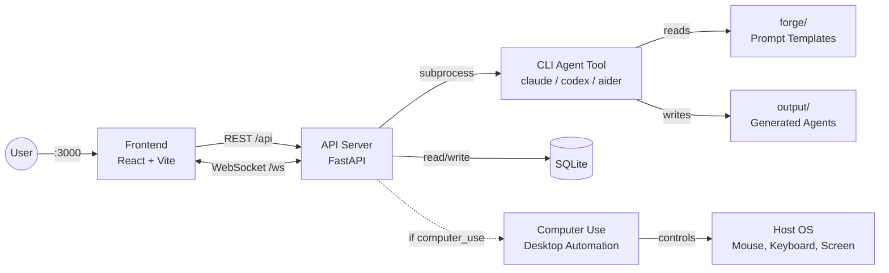

# Agent Forge

Independent agents that can operate on any task, no matter how complex.

Agent Forge gives AI agents the ability to think through problems (forge) and interact with the real world (computer use). Each module works on its own or together with the others. Cross-platform: runs on Windows, Linux, and macOS (Work progres).

## Install

Works on **Linux**, **WSL**, and **Windows**. macOS support is in progress (agent creation and CLI steps work, computer use does not). The installer sets up everything: git, Python, Node.js, dependencies, and the `forge` CLI.

```bash
# Linux / macOS / WSL
curl -fsSL https://raw.githubusercontent.com/MONTBRAIN/Agent-Forge/master/setup.sh | bash
```

```powershell
# Windows (PowerShell)
irm https://raw.githubusercontent.com/MONTBRAIN/Agent-Forge/master/setup.ps1 | iex
```

Then install at least one CLI agent tool:

```bash
# Pick one (or add your own to providers.yaml)
curl -fsSL https://claude.ai/install.sh | bash              # Claude Code (Linux/macOS)
irm https://claude.ai/install.ps1 | iex                    # Claude Code (Windows)
npm install -g @openai/codex                               # Codex
npm install -g @google/gemini-cli                           # Gemini CLI
```

Restart your terminal, then:

```bash
forge start
```

### Forge CLI

| Command | Description |
|---------|-------------|
| `forge start` | Start API and frontend servers |
| `forge stop` | Stop all services |
| `forge restart` | Restart all services |
| `forge api` | Start only the API server |
| `forge status` | Show if services are running |
| `forge health` | Check API health |
| `forge agents` | List all agents |
| `forge providers` | List available providers and models |
| `forge info` | Show system information |
| `forge update` | Pull latest code and reinstall deps if changed |
| `forge logs` | Tail API server logs |
| `forge help` | Show this help message |

### Manual setup

If you prefer to set things up manually, see [api/README.md](api/README.md) and [frontend/README.md](frontend/README.md).

Provider parser families and real sample log lines are documented in [PROVIDER_PARSER_GUIDE.md](PROVIDER_PARSER_GUIDE.md).

## Architecture



## Modules

### [api/](api/) - REST API + Execution Engine

FastAPI backend for agent CRUD, forge generation, and execution. Calls any CLI agent tool as a subprocess via config-driven providers. See [api/README.md](api/README.md) for setup details.

### [frontend/](frontend/) - Web Dashboard

React 19 + TypeScript + Vite dashboard for managing agents and viewing runs. See [frontend/README.md](frontend/README.md) for setup details.

### [forge/](forge/) - Workflow Generation Engine

Designs and generates complete agentic workflow projects through a 7-step conversational process. Agent-agnostic: works with any AI coding agent that can read files and follow instructions.

### [computer_use/](computer_use/) - Desktop Automation Engine

Captures screenshots, locates UI elements, and executes mouse/keyboard actions across **Windows, macOS, and Linux** (including WSL2). Works as a Python library, MCP server, or CLI tool. Runs natively on the host.

### paper/ - Research Paper

Academic paper documenting the framework.

## Structure

```
Agent-Forge/
├── api/                   # REST API + execution engine
│   ├── main.py            # FastAPI app
│   ├── routes/            # HTTP endpoints
│   ├── services/          # Business logic
│   ├── engine/            # CLI provider executor
│   └── persistence/       # SQLite database
├── frontend/              # React web dashboard
│   ├── src/pages/         # Dashboard, Agents, Runs, Settings
│   ├── src/components/    # UI components
│   └── src/hooks/         # TanStack Query hooks
├── forge/                 # Workflow generation engine (standalone)
│   ├── agentic.md         # 7-step orchestrator
│   ├── Prompts/           # Specialized agent prompts
│   ├── patterns/          # 10 reusable workflow patterns
│   └── examples/          # 3 example workflows
├── computer_use/          # Desktop automation engine (standalone)
│   ├── core/              # Engine facade, types, actions
│   ├── platform/          # OS backends (Linux, Windows, macOS, WSL2)
│   └── mcp_server.py      # MCP server
├── providers.yaml         # CLI provider configs (claude, codex, aider, etc.)
├── data/                  # SQLite database (created at runtime)
├── output/                # Generated agent workflows
└── paper/                 # Research paper
```

## Contributing

1. Create a branch from `master`:
   ```bash
   git checkout master && git checkout -b feature/your-change
   ```
2. Make your changes and commit:
   ```bash
   git add . && git commit -m "your message"
   ```
3. Push and open a PR into `master`:
   ```bash
   git push -u origin feature/your-change
   ```
