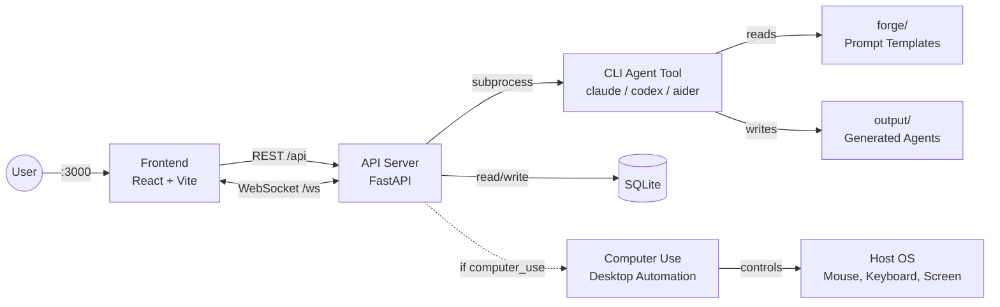

# Agent Forge

Independent agents that can operate on any task, no matter how complex.

Agent Forge gives AI agents the ability to think through problems (forge) and interact with the real world (computer use). Each module works on its own or together with the others. Cross-platform: runs on Windows, macOS, and Linux.

## Quick Start

### Prerequisites

Works on **Windows**, **macOS**, and **Linux**.

- Python >= 3.12
- Node.js >= 22
- At least one CLI agent tool installed and authenticated (see [providers.yaml](providers.yaml)):
  - [Claude Code](https://docs.anthropic.com/en/docs/claude-code) -- `npm install -g @anthropic-ai/claude-code && claude auth`
  - [Codex](https://github.com/openai/codex) -- `npm install -g @openai/codex`
  - [Aider](https://aider.chat) -- `pip install aider-chat`
  - [Gemini CLI](https://github.com/google-gemini/gemini-cli) -- `npm install -g @anthropic-ai/gemini-cli`
  - Or any other CLI tool -- just add an entry to `providers.yaml`

### Run everything

**1. Backend**

```bash
cd api
python3 -m venv .venv
```

```bash
# Linux/macOS
source .venv/bin/activate

# Windows (PowerShell)
.venv\Scripts\Activate.ps1
```

```bash
pip install -r requirements.txt
cd ..
```

```bash
# Linux/macOS
PYTHONPATH=. python -m uvicorn api.main:app --host 127.0.0.1 --port 8000

# Windows (PowerShell)
$env:PYTHONPATH="."; python -m uvicorn api.main:app --host 127.0.0.1 --port 8000
```

**2. Frontend** (new terminal)

```bash
cd frontend
npm install
npm run dev
```

**3. Open http://localhost:3000**

## Architecture



## Modules

### [api/](api/) - REST API + Execution Engine

FastAPI backend for agent CRUD, forge generation, and execution. Calls any CLI agent tool as a subprocess via config-driven providers. See [api/README.md](api/README.md) for setup details.

### [frontend/](frontend/) - Web Dashboard

React 19 + TypeScript + Vite dashboard for managing agents and viewing runs. See [frontend/README.md](frontend/README.md) for setup details.

### [forge/](forge/) - Workflow Generation Engine

Designs and generates complete agentic workflow projects through a 7-step conversational process. Agent-agnostic: works with any AI coding agent that can read files and follow instructions.

### [computer_use/](computer_use/) - Desktop Automation Engine

Captures screenshots, locates UI elements, and executes mouse/keyboard actions across **Windows, macOS, and Linux** (including WSL2). Works as a Python library, MCP server, or CLI tool. Runs natively on the host.

### paper/ - Research Paper

Academic paper documenting the framework.

## Structure

```
Agent-Forge/
├── api/                   # REST API + execution engine
│   ├── main.py            # FastAPI app
│   ├── routes/            # HTTP endpoints
│   ├── services/          # Business logic
│   ├── engine/            # CLI provider executor
│   └── persistence/       # SQLite database
├── frontend/              # React web dashboard
│   ├── src/pages/         # Dashboard, Agents, Runs, Settings
│   ├── src/components/    # UI components
│   └── src/hooks/         # TanStack Query hooks
├── forge/                 # Workflow generation engine (standalone)
│   ├── agentic.md         # 7-step orchestrator
│   ├── Prompts/           # Specialized agent prompts
│   ├── patterns/          # 10 reusable workflow patterns
│   └── examples/          # 3 example workflows
├── computer_use/          # Desktop automation engine (standalone)
│   ├── core/              # Engine facade, types, actions
│   ├── platform/          # OS backends (Linux, Windows, macOS, WSL2)
│   └── mcp_server.py      # MCP server
├── providers.yaml         # CLI provider configs (claude, codex, aider, etc.)
├── data/                  # SQLite database (created at runtime)
├── output/                # Generated agent workflows
└── paper/                 # Research paper
```

## Contributing

1. Create a branch from `master`:
   ```bash
   git checkout master && git checkout -b feature/your-change
   ```
2. Make your changes and commit:
   ```bash
   git add . && git commit -m "your message"
   ```
3. Push and open a PR into `master`:
   ```bash
   git push -u origin feature/your-change
   ```
