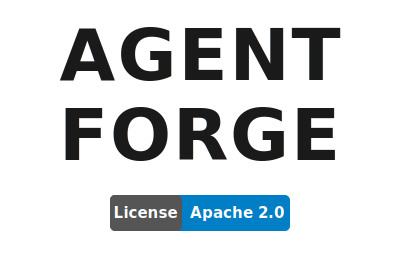
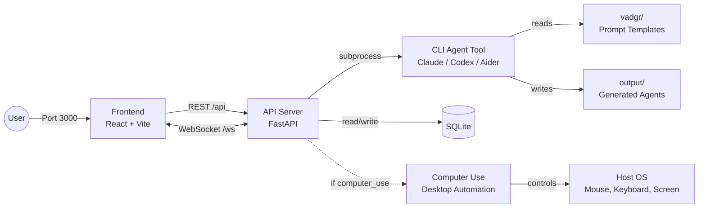

<p align="center">
  
  <picture>
    <source media="(prefers-color-scheme: dark)" srcset="docs/NameLigth.svg">
    <source media="(prefers-color-scheme: light)" srcset="docs/NameDark.svg">
    
  </picture>
</p>

<p align="center">
  
</p>


<p align="center">
  <i><b>Open-source AI agents that work on your computer.</b></i>
</p>

Describe your work. Vadgr builds an agent for it. The agent runs on your machine -- writing code, controlling apps, clicking buttons, and delivering results -- while you do something else. Works with Claude Code, Codex, Gemini, or any CLI agent tool. Cross-platform: Linux, Windows (WSL2), and macOS (in progress).

## Platform

<div align="left">

|  | Technology | Status | Role |
|:---:|:---:|:---:|:---|
|  | Linux | Stable | Primary platform |
|  | Windows / WSL2 | Stable | Supported platform |
|  | macOS | WIP | Work in progress |

</div>

## Install

Works on **Linux**, **WSL**, and **Windows**. macOS support is in progress (agent creation and CLI steps work, computer use does not). The installer sets up everything: git, Python, Node.js, dependencies, and the `vadgr` CLI.

```bash
# Linux / macOS / WSL
curl -fsSL https://raw.githubusercontent.com/MONTBRAIN/Agent-Forge/master/setup.sh | bash
```

```powershell
# Windows (PowerShell)
irm https://raw.githubusercontent.com/MONTBRAIN/Agent-Forge/master/setup.ps1 | iex
```

Then install at least one CLI agent tool:

```bash
# Pick one (or add your own to providers.yaml)
curl -fsSL https://claude.ai/install.sh | bash              # Claude Code (Linux/macOS)
irm https://claude.ai/install.ps1 | iex                    # Claude Code (Windows)
npm install -g @openai/codex                               # Codex
npm install -g @google/gemini-cli                           # Gemini CLI
```

Restart your terminal, then:

```bash
vadgr start
```

### Vadgr CLI

**Services:**

| Command | Description |
|---------|-------------|
| `vadgr start` | Start API and frontend servers |
| `vadgr stop` | Stop all services |
| `vadgr restart` | Restart all services |
| `vadgr status` | Show if services are running |
| `vadgr logs` | Tail API server logs |
| `vadgr update` | Pull latest code and reinstall deps |

**Agents and runs:**

| Command | Description |
|---------|-------------|
| `vadgr ps` | List all agents |
| `vadgr agents list` | List all agents |
| `vadgr agents get <id>` | Show agent details |
| `vadgr agents create --name "..." --description "..."` | Create a new agent |
| `vadgr agents update <id> [--name] [--description]` | Update an agent |
| `vadgr agents delete <id>` | Delete an agent |
| `vadgr agents export <id> [-o file.agnt]` | Export agent as .agnt archive |
| `vadgr agents import <file.agnt>` | Import agent from .agnt archive |
| `vadgr run <name> [--input key=value]` | Run an agent (interactive inputs) |
| `vadgr run <name> --background` | Run without streaming progress |
| `vadgr runs list [--status failed]` | List runs |
| `vadgr runs get <id>` | Show run details |
| `vadgr runs cancel <id>` | Cancel a running run |
| `vadgr runs resume <id>` | Resume a failed run from last completed step |
| `vadgr runs logs <id>` | Show run logs |

**Info:**

| Command | Description |
|---------|-------------|
| `vadgr health` | Check API health |
| `vadgr providers` | List available providers and models |
| `vadgr computer-use enable` | Enable desktop automation |
| `vadgr computer-use disable` | Disable desktop automation |
| `vadgr computer-use status` | Show computer use and daemon status |

**Registry** -- package manager for agent workflows:

| Command | Description |
|---------|-------------|
| `vadgr registry pack <folder>` | Package agent folder into `.agnt` archive |
| `vadgr registry pull <name>` | Download and install agent from registry |
| `vadgr registry push <file.agnt>` | Publish `.agnt` to a registry |
| `vadgr registry search <query>` | Search registries for agents |
| `vadgr registry serve` | Start a self-hosted registry server |
| `vadgr registry add <name> --type ...` | Add a registry to config |
| `vadgr registry use <name>` | Set active registry |
| `vadgr registry list` | List configured registries |
| `vadgr registry remove <name>` | Remove a registry |

### Manual setup

If you prefer to set things up manually, see [api/README.md](api/README.md) and [frontend/README.md](frontend/README.md).

Provider parser families and real sample log lines are documented in [PROVIDER_PARSER_GUIDE.md](PROVIDER_PARSER_GUIDE.md).

## Architecture



## Modules

### [cli/](cli/) - Command-Line Interface

Unified CLI built with Click. Manages agents, runs, registry, and services. Talks to the API over HTTP for agent/run operations; calls the registry module directly for package management.

### [api/](api/) - REST API + Execution Engine

FastAPI backend for agent CRUD, generation, and execution. Spawns any CLI agent tool (Claude Code, Codex, Gemini) as a subprocess via config-driven providers. Supports multi-step orchestration with approval gates, resume, and retry. See [api/README.md](api/README.md).

### [frontend/](frontend/) - Web Dashboard

React 19 + TypeScript + Vite dashboard for creating agents, monitoring runs in real-time, and configuring integrations (Discord gateway, computer use). See [frontend/README.md](frontend/README.md).

### [forge/](forge/) - Agent Generation Engine

Describe what you want automated. Forge generates a complete agent project through a 7-step process: requirements, architecture, scaffold, orchestrator, prompts, scripts, and review. Agent-agnostic: works with any AI coding tool.

### Desktop Automation

The desktop-automation MCP server lives in its own repository: **[vadgr-computer-use](https://github.com/MONTBRAIN/vadgr-computer-use)**. Install with `pip install vadgr-computer-use`. It gives agents eyes and hands via OS accessibility APIs with a vision fallback.

### [gateway/](gateway/) - Messaging Integration

Chat with agents from Discord. List agents, run them, monitor progress, and receive results -- all from Discord DMs or @mentions. Session-aware conversations with security (input sanitization, sender allowlist, audit logging).

### [registry/](registry/) - Agent Package Manager

Package, publish, and install agents as `.agnt` archives. Supports GitHub, HTTP, and local registries. Includes SHA256 integrity verification, SSRF protection, and zip slip prevention.

## Structure

```
Vadgr/
├── cli/                   # Unified command-line interface
│   ├── main.py            # Root Click group
│   ├── http.py            # HTTP client for API
│   ├── commands/          # agents, runs, registry, gateway, info
│   └── tests/             # Unit + integration tests
├── api/                   # REST API + execution engine
│   ├── main.py            # FastAPI app
│   ├── routes/            # HTTP endpoints
│   ├── services/          # Business logic + gateway setup
│   ├── engine/            # CLI provider executor + DAG orchestration
│   └── persistence/       # SQLite database
├── frontend/              # React web dashboard
│   ├── src/pages/         # Dashboard, Agents, Runs, Settings
│   ├── src/components/    # UI components
│   └── src/hooks/         # TanStack Query + messaging gateway hooks
├── forge/                 # Agent generation engine (standalone)
│   ├── agentic.md         # 7-step orchestrator
│   ├── Prompts/           # Specialized agent prompts
│   ├── patterns/          # Reusable workflow patterns
│   └── examples/          # Example agents
# Desktop automation lives in:
# https://github.com/MONTBRAIN/vadgr-computer-use
# (installed via `pip install vadgr-computer-use` when enabled)
├── gateway/               # Messaging integration
│   ├── src/               # Discord adapter, router, security, API client
│   └── tests/             # 70 tests
├── registry/              # Agent package manager
│   ├── security.py        # Zip safety, SSRF, SHA256, TLS
│   ├── server.py          # Self-hosted HTTP registry server
│   └── adapters/          # GitHub, HTTP, local backends
├── providers.yaml         # CLI provider configs (Claude, Codex, Gemini)
├── data/                  # SQLite database (created at runtime)
└── output/                # Generated agents land here
```

## Technologies

**Frontend**

<div align="left">

|  | Technology | Version | Role |
|:---:|:---:|:---:|:---|
|  | React | 19.2 | UI framework |
|  | TypeScript | 5.9 | Type-safe JavaScript |
|  | Vite | 7.3 | Build tool and dev server |
|  | Tailwind CSS | 4.2 | Utility-first CSS framework |
|  | TanStack Query | 5.90 | Data fetching and state management |
|  | React Router | 7.13 | Client-side routing |
|  | Vitest | 4.0 | Unit testing framework |
|  | ESLint | 9.39 | Code linting |

</div>

**Backend**

<div align="left">

|  | Technology | Version | Role |
|:---:|:---:|:---:|:---|
|  | FastAPI | 0.115 | Web framework |
|  | Python | 3.12 | Runtime language |
|  | SQLite | 3 | Relational database |
|  | Pydantic | 2.10 | Data validation |
|  | WebSockets | 14.0 | Real-time communication |
|  | pytest | 8.0 | Testing framework |

</div>

**Desktop Automation**

<div align="left">

|  | Technology | Version | Role |
|:---:|:---:|:---:|:---|
|  | Pillow | 10.0 | Image processing |
|  | mss | 9.0 | Screenshot capture |
| <picture><source media="(prefers-color-scheme: dark)" srcset="https://cdn.simpleicons.org/anthropic/white"></picture> | MCP | 1.0 | Standardized tool interface |

</div>

## Contributing

1. Create a branch from `master`:
   ```bash
   git checkout master && git checkout -b feature/your-change
   ```
2. Make your changes and commit:
   ```bash
   git add . && git commit -m "your message"
   ```
3. Push and open a PR into `master`:
   ```bash
   git push -u origin feature/your-change
   ```

