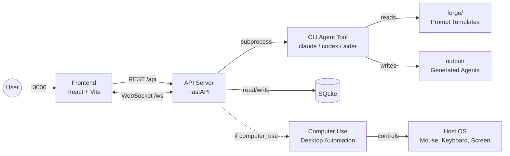

<p align="center">
  
</p>

<h1 align="center">Agent Forge</h1>

<p align="center">
  Independent agents that can operate on any task, no matter how complex.
</p>

Agent Forge gives AI agents the ability to think through problems (forge) and interact with the real world (computer use). Each module works on its own or together with the others. Cross-platform: runs on Windows, Linux, and macOS (Work progres).

## Technologies

### Frontend

<div align="left">

|  | Technology | Version | Role |
|:---:|:---:|:---:|:---|
|  | React | 19.2 | UI framework |
|  | TypeScript | 5.9 | Type-safe JavaScript |
|  | Vite | 7.3 | Build tool and dev server |
|  | Tailwind CSS | 4.2 | Utility-first CSS framework |
|  | TanStack Query | 5.90 | Data fetching and state management |
|  | React Router | 7.13 | Client-side routing |
|  | Vitest | 4.0 | Unit testing framework |
|  | ESLint | 9.39 | Code linting |

</div>

### Backend

<div align="left">

|  | Technology | Version | Role |
|:---:|:---:|:---:|:---|
|  | FastAPI | 0.115 | Web framework |
|  | Python | 3.12 | Runtime language |
|  | SQLite | 3 | Relational database |
|  | Pydantic | 2.10 | Data validation |
|  | WebSockets | 14.0 | Real-time communication |
|  | pytest | 8.0 | Testing framework |

</div>

### Desktop Automation

<div align="left">

|  | Technology | Version | Role |
|:---:|:---:|:---:|:---|
|  | Pillow | 10.0 | Image processing |
|  | mss | 9.0 | Screenshot capture |
|  | MCP | 1.0 | Standardized tool interface |

</div>

### Paltform

<div align="left">

|  | Technology | Status | Role |
|:---:|:---:|:---:|:---|
|  | Linux | Stable | Primary platform |
|  | Windows / WSL2 | Stable | Supported platform |
|  | macOS | WIP | Work in progress |

</div>

## Install

Works on **Linux**, **WSL**, and **Windows**. macOS support is in progress (agent creation and CLI steps work, computer use does not). The installer sets up everything: git, Python, Node.js, dependencies, and the `forge` CLI.

```bash
# Linux / macOS / WSL
curl -fsSL https://raw.githubusercontent.com/MONTBRAIN/Agent-Forge/master/setup.sh | bash
```

```powershell
# Windows (PowerShell)
irm https://raw.githubusercontent.com/MONTBRAIN/Agent-Forge/master/setup.ps1 | iex
```

Then install at least one CLI agent tool:

```bash
# Pick one (or add your own to providers.yaml)
curl -fsSL https://claude.ai/install.sh | bash              # Claude Code (Linux/macOS)
irm https://claude.ai/install.ps1 | iex                    # Claude Code (Windows)
npm install -g @openai/codex                               # Codex
npm install -g @google/gemini-cli                           # Gemini CLI
```

Restart your terminal, then:

```bash
forge start
```

### Forge CLI

**Services:**

| Command | Description |
|---------|-------------|
| `forge start` | Start API and frontend servers |
| `forge stop` | Stop all services |
| `forge restart` | Restart all services |
| `forge status` | Show if services are running |
| `forge logs` | Tail API server logs |
| `forge update` | Pull latest code and reinstall deps |

**Agents and runs:**

| Command | Description |
|---------|-------------|
| `forge ps` | List all agents |
| `forge agents list` | List all agents |
| `forge agents get <id>` | Show agent details |
| `forge agents create --name "..." --description "..."` | Create a new agent |
| `forge agents update <id> [--name] [--description]` | Update an agent |
| `forge agents delete <id>` | Delete an agent |
| `forge agents export <id> [-o file.agnt]` | Export agent as .agnt archive |
| `forge agents import <file.agnt>` | Import agent from .agnt archive |
| `forge run <name> [--input key=value]` | Run an agent (interactive inputs) |
| `forge run <name> --background` | Run without streaming progress |
| `forge runs list [--status failed]` | List runs |
| `forge runs get <id>` | Show run details |
| `forge runs cancel <id>` | Cancel a running run |
| `forge runs logs <id>` | Show run logs |

**Info:**

| Command | Description |
|---------|-------------|
| `forge health` | Check API health |
| `forge providers` | List available providers and models |
| `forge computer-use enable` | Enable desktop automation |
| `forge computer-use disable` | Disable desktop automation |
| `forge computer-use status` | Show computer use and daemon status |

**Registry** -- package manager for agent workflows:

| Command | Description |
|---------|-------------|
| `forge registry pack <folder>` | Package agent folder into `.agnt` archive |
| `forge registry pull <name>` | Download and install agent from registry |
| `forge registry push <file.agnt>` | Publish `.agnt` to a registry |
| `forge registry search <query>` | Search registries for agents |
| `forge registry serve` | Start a self-hosted registry server |
| `forge registry add <name> --type ...` | Add a registry to config |
| `forge registry use <name>` | Set active registry |
| `forge registry list` | List configured registries |
| `forge registry remove <name>` | Remove a registry |

### Manual setup

If you prefer to set things up manually, see [api/README.md](api/README.md) and [frontend/README.md](frontend/README.md).

Provider parser families and real sample log lines are documented in [PROVIDER_PARSER_GUIDE.md](PROVIDER_PARSER_GUIDE.md).

## Architecture



## Modules

### [cli/](cli/) - Command-Line Interface

Unified CLI built with Click. Manages agents, runs, registry, and system info. Talks to the API over HTTP for agent/run operations; calls the registry module directly for package management. Each module has its own venv.

### [api/](api/) - REST API + Execution Engine

FastAPI backend for agent CRUD, forge generation, and execution. Calls any CLI agent tool as a subprocess via config-driven providers. See [api/README.md](api/README.md) for setup details.

### [frontend/](frontend/) - Web Dashboard

React 19 + TypeScript + Vite dashboard for managing agents and viewing runs. See [frontend/README.md](frontend/README.md) for setup details.

### [forge/](forge/) - Workflow Generation Engine

Designs and generates complete agentic workflow projects through a 7-step conversational process. Agent-agnostic: works with any AI coding agent that can read files and follow instructions.

### [computer_use/](computer_use/) - Desktop Automation Engine

Captures screenshots, locates UI elements, and executes mouse/keyboard actions across **Windows, macOS, and Linux** (including WSL2). Works as a Python library, MCP server, or CLI tool. Runs natively on the host.

### [registry/](registry/) - Agent Package Manager

Package, publish, and install agent workflows. Supports three backends: GitHub (releases + raw content), any HTTP server, or a local folder. Agents are distributed as `.agnt` archives (zip with manifest). Includes SHA256 integrity verification, SSRF protection, and zip slip prevention.

### paper/ - Research Paper

Academic paper documenting the framework.

## Structure

```
Agent-Forge/
├── cli/                   # Unified command-line interface
│   ├── main.py            # Root Click group
│   ├── http.py            # HTTP client for API
│   ├── commands/          # agents, runs, registry, info
│   └── tests/             # Unit + integration tests
├── api/                   # REST API + execution engine
│   ├── main.py            # FastAPI app
│   ├── routes/            # HTTP endpoints
│   ├── services/          # Business logic
│   ├── engine/            # CLI provider executor
│   └── persistence/       # SQLite database
├── frontend/              # React web dashboard
│   ├── src/pages/         # Dashboard, Agents, Runs, Settings
│   ├── src/components/    # UI components
│   └── src/hooks/         # TanStack Query hooks
├── forge/                 # Workflow generation engine (standalone)
│   ├── agentic.md         # 7-step orchestrator
│   ├── Prompts/           # Specialized agent prompts
│   ├── patterns/          # 10 reusable workflow patterns
│   └── examples/          # 3 example workflows
├── computer_use/          # Desktop automation engine (standalone)
│   ├── core/              # Engine facade, types, actions
│   ├── platform/          # OS backends (Linux, Windows, macOS, WSL2)
│   └── mcp_server.py      # MCP server
├── registry/              # Agent package manager
│   ├── cli.py             # Click CLI (pack, pull, push, search)
│   ├── security.py        # Zip safety, SSRF, SHA256, TLS
│   ├── server.py          # Self-hosted HTTP registry server
│   └── adapters/          # GitHub, HTTP, local backends
├── providers.yaml         # CLI provider configs (claude, codex, aider, etc.)
├── data/                  # SQLite database (created at runtime)
├── output/                # Generated agent workflows
└── paper/                 # Research paper
```

## Contributing

1. Create a branch from `master`:
   ```bash
   git checkout master && git checkout -b feature/your-change
   ```
2. Make your changes and commit:
   ```bash
   git add . && git commit -m "your message"
   ```
3. Push and open a PR into `master`:
   ```bash
   git push -u origin feature/your-change
   ```
