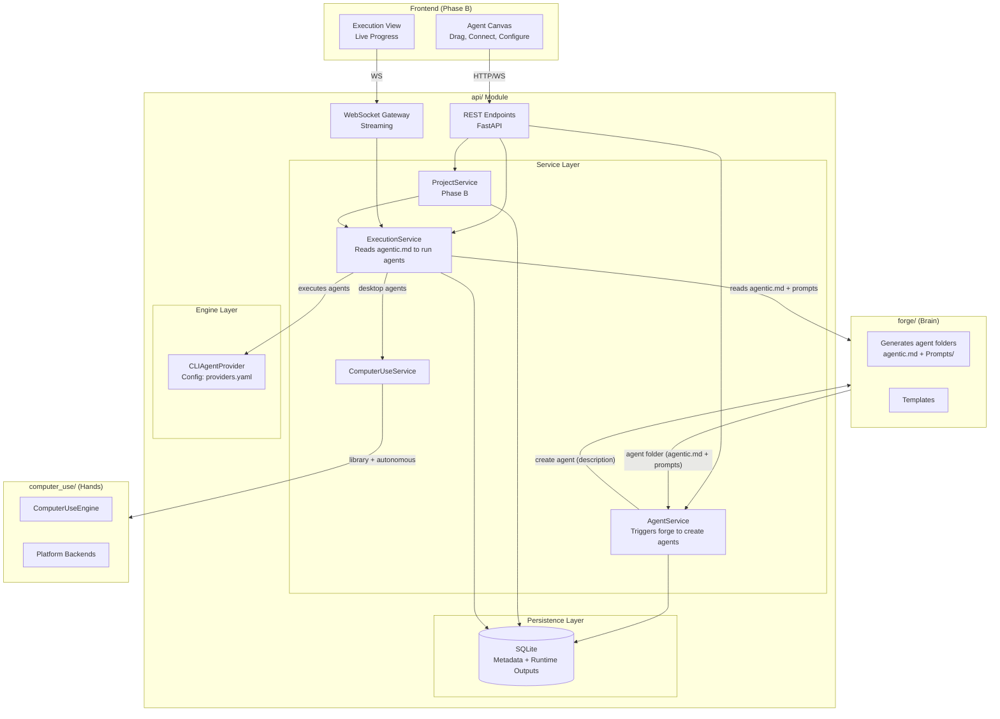
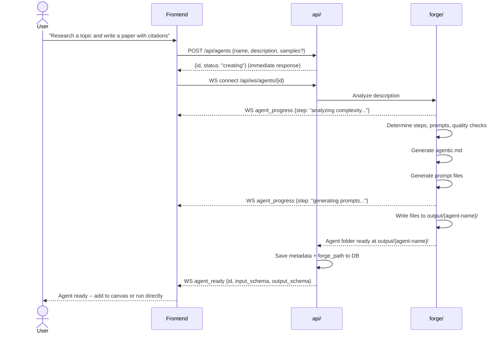
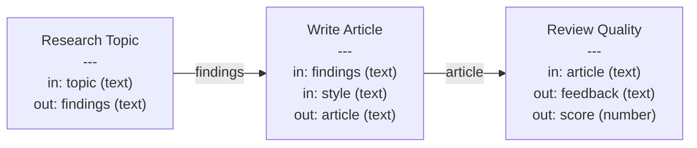
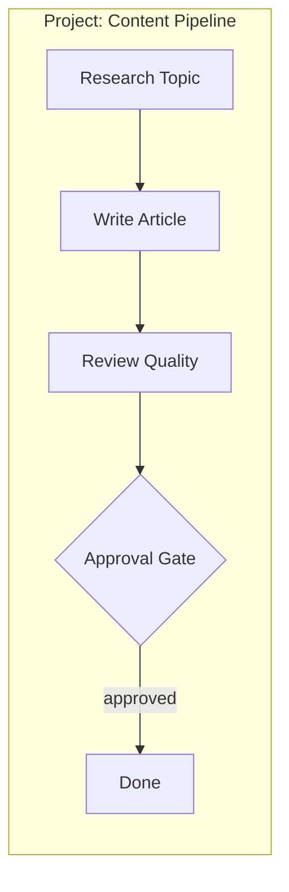
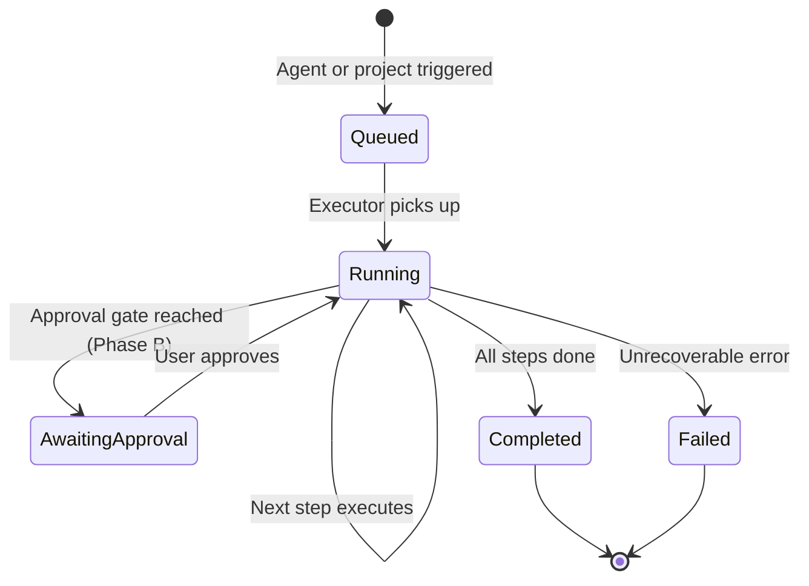
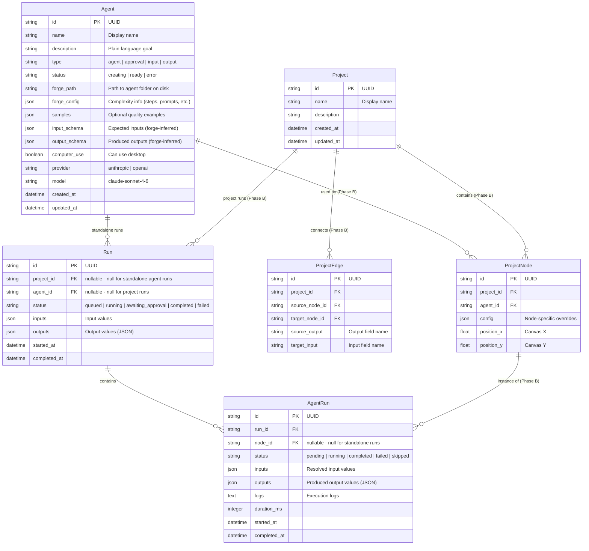
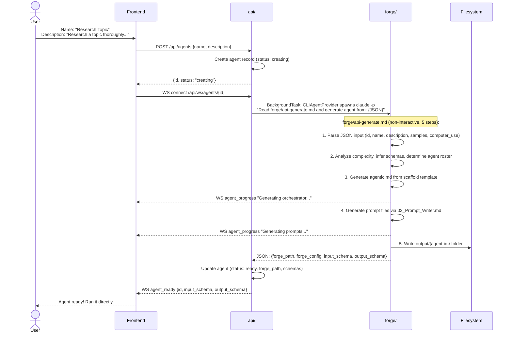
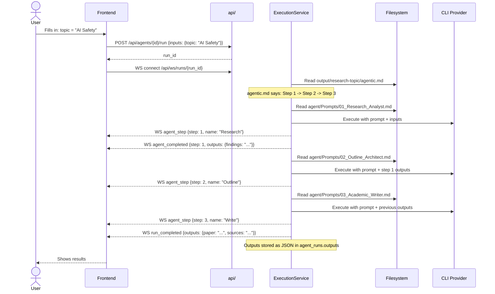
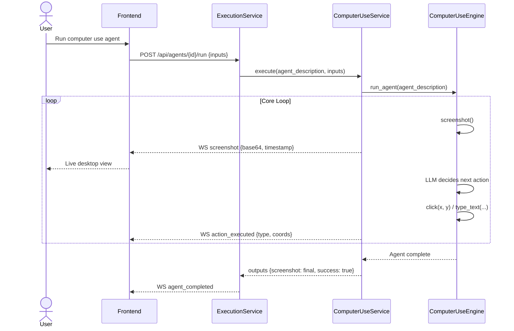
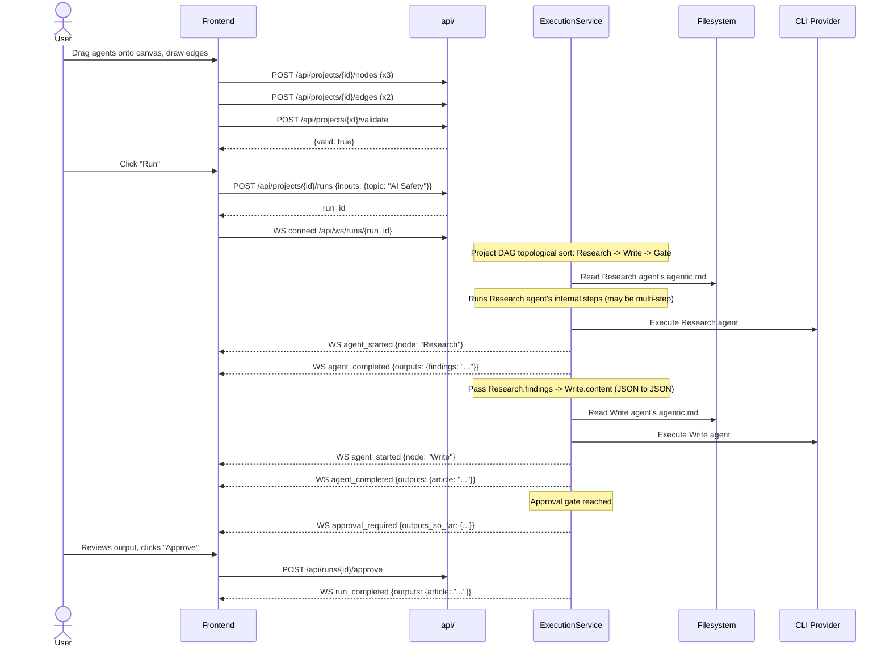

# API Module Architecture

## Vision

Agent Forge becomes a **visual orchestration platform** for AI agents. Users build automation by composing agents on a canvas, connecting outputs to inputs, and hitting run. No code required.

The platform has two layers:

- **Agent** -- the atomic unit. An agent is a **complete forge-generated workflow**: an orchestrator (`agentic.md`), prompts, quality checks, and config -- all in one folder. The user describes the goal, forge builds the entire agent. On the canvas, it's one box. Internally, it can be as complex as forge decides.
- **Project** -- a DAG (directed acyclic graph) of connected agents. The output of one agent flows as input to the next. Agents can branch, merge, and run in parallel. The user decides the project-level orchestration.

Two levels of orchestration:

1. **Agent level** (internal) -- Forge decides. Each agent has its own `agentic.md` that defines how it works internally: which prompts to run, in what order, with what quality checks. The user never sees this.
2. **Project level** (canvas) -- User decides. The user drags agents onto the canvas, connects them, and defines the data flow. The DAG engine handles this.

How agents get used is up to the user:

- **Standalone** -- User reads the agent's `agentic.md` and follows the steps manually or with Claude Code.
- **API platform** -- User drags agents onto a canvas, connects them, and hits run. The execution service reads each agent's `agentic.md` and follows it programmatically.

The `api/` module joins `forge/` (the brain) and `computer_use/` (the hands) into a service that a visual frontend can consume.

### Design Principles

1. **Forge creates, users orchestrate** -- Forge's job is to build agents from descriptions (full workflow folders with `agentic.md` + prompts). The user decides how to connect and run them -- either visually on the canvas or manually.
2. **An agent is a workflow, not a prompt** -- A prompt is just a file. An agent is the whole thing: orchestrator, prompts, quality loops, config. Forge generates the complete agent.
3. **The user never thinks about prompts, models, or LLM internals** -- They describe what they want in plain language. Forge builds the agent. The user sees one box on the canvas.
4. **Module independence preserved** -- `forge/` and `computer_use/` remain standalone. The API imports them; they never import the API.
5. **Definition vs execution** -- An agent/project is a reusable template (like a Docker image). A run is one execution of it (like a container). You can run the same project many times with different inputs.
6. **Visual-first** -- Every concept maps to something you can see and drag on a canvas.

---

## Implementation Phases

The MVP is split into two phases. Phase A ships first and delivers immediate value. Phase B adds the canvas and project orchestration on top.

### Phase A: Agents (MVP-A)

The core loop: user describes a goal, forge builds an agent, user runs it.

- Agent creation via forge (user describes goal, forge generates the agent)
- Agent management (list, view, delete)
- Run an agent directly (`POST /api/agents/{id}/run`)
- WebSocket streaming (creation progress + execution progress)
- Computer use agents (desktop automation via `computer_use/` engine)
- SQLite persistence
- Health endpoint

**What Phase A does NOT include:**

- Projects, canvas, DAG
- Connecting agents together
- Approval gate nodes (added in Phase B with projects)

### Phase B: Projects + Canvas (MVP-B)

Once agents work end-to-end, add project-level orchestration:

- Project CRUD (canvas with nodes and edges)
- DAG validation (cycle detection, missing inputs)
- Sequential execution of a project (run agents in topological order)
- Approval gate nodes (pause execution, wait for user)
- Agent input/output wiring on canvas
- React + React Flow frontend

### Future Phases

Once both MVP phases are solid, these are added incrementally:

| Phase | Feature | Description |
|---|---|---|
| 3 | **Parallel execution** | Agents without dependencies run concurrently via `asyncio.gather` |
| 3 | **Loop nodes** | Repeat an agent until a condition is met |
| 3 | **Conditional nodes** | Route data based on conditions |
| 4 | **Agent library** | Pre-built reusable agent templates |
| 4 | **Project templates** | Starter projects (research pipeline, content pipeline) |
| 4 | **Binary artifacts** | Support for large file outputs (PDFs, images) with `data/artifacts/` |
| 4 | **Agent editing** | Re-trigger forge to regenerate prompts when description changes |
| 5 | **Authentication** | API key auth for remote access |
| 5 | **Export/import** | Share agents and projects |

---

## System Architecture



---

## Core Concepts

### Agent (Definition)

An agent is a **complete forge-generated workflow**. Not a prompt -- a prompt is just a file. An agent is the whole thing:

```
output/{agent-id}/
├── agentic.md              # How the agent works (orchestrator)
├── agent/Prompts/          # The prompts it uses internally
│   ├── 01_Research_Analyst.md
│   ├── 02_Outline_Architect.md
│   └── 03_Academic_Writer.md
└── ...
```

API-created agents use the agent's UUID as the folder name (`output/{agent-id}/`) to enable reliable cleanup on deletion. Standalone forge workflows (created via `forge/agentic.md`) continue to use kebab-case names (`output/{workflow-name}/`).

The user describes what the agent should accomplish in plain language. Forge runs its generation process and creates the full agent folder -- orchestrator, prompts, quality checks, everything.

- **Simple agent** -- Forge generates a lightweight `agentic.md` with one step and one prompt (e.g., "Summarize this text in 3 bullet points")
- **Complex agent** -- Forge generates a full `agentic.md` with multiple steps, multiple prompts, quality loops, approval gates (e.g., "Research a topic thoroughly and write a paper with citations")

Either way, on the canvas it's **one node**. The internal complexity is hidden. When the execution service runs the agent, it reads the agent's `agentic.md` and follows it.

Optionally, the user can provide **quality samples** -- examples of what the final output should look like. Forge uses these to calibrate the generated prompts.

Agents can optionally enable computer use -- when enabled, the agent interacts with the desktop (screenshots, clicks, typing) via `computer_use/`.

### Agent Creation Flow

Creating an agent is not a simple CRUD operation. It's a **forge invocation** that generates files:



For simple descriptions, this takes seconds. For complex ones, it may take longer as forge generates multiple prompts with quality checks.

### Storage Model

Two types of data, two storage strategies:

| What | Where | Why |
|---|---|---|
| **Agent definition** (agentic.md + prompts) | Filesystem: `output/{agent-id}/` | Can be large, git-trackable, human-readable, editable, works standalone |
| **Agent metadata** (name, type, model, path) | DB: `agents` table | Queryable, drives the UI and canvas |
| **Runtime outputs** (what agents produce when run) | DB: `agent_runs.outputs` as JSON | Structured, flows through the DAG, displayed in UI |
| **Binary artifacts** (PDFs, images -- future) | Filesystem: `data/artifacts/{run_id}/` | Too large for DB, referenced via JSON in outputs |

The `agents` table stores a `forge_path` that points to the agent's folder on disk. At runtime, the execution service reads `agentic.md` from that folder and follows it to run the agent.

```
output/
  a1b2c3d4-e5f6.../                   # API agent (UUID as folder name)
    agentic.md                        # Internal orchestrator
    agent/Prompts/
      01_Research_Analyst.md
      02_Outline_Architect.md
      03_Academic_Writer.md

  my-workflow/                        # Standalone forge workflow (kebab-case name)
    agentic.md                        # One-step orchestrator
    agent/Prompts/
      01_Summarizer.md

data/
  agent_forge.db                      # Metadata, runs, runtime outputs
```

### Agent Input/Output Contract

Every agent declares what data it accepts and what it produces. Forge infers the input/output schema from the description and generates it. In Phase A, this is used for standalone runs. In Phase B, this is how agents connect on the canvas.



### Project (Definition) -- Phase B

A project is a **DAG of agents** with edges that define data flow. It's the canvas -- what the user builds visually. The user decides the project-level orchestration: which agents connect to which, what runs in parallel, where approval gates go.

Each node on the canvas is one agent. Each agent runs according to its own internal `agentic.md`. The project DAG just defines the order and data flow between agents.



### Run (Execution)

A run is **one execution of an agent or project** with specific input values. In Phase A, runs are standalone agent executions. In Phase B, a project run executes the full DAG (each node runs its agent's `agentic.md` in topological order).



### Node Types

| Node Type | Phase | Behavior |
|---|---|---|
| **Agent** | A | Forge-generated workflow. Runs its internal `agentic.md`. Accepts inputs, produces outputs. |
| **Computer Use Agent** | A | Same as Agent, but includes desktop automation steps via `ComputerUseEngine` |
| **Approval Gate** | B | Pauses execution, shows output, waits for user approve/revise |
| **Input** | B | Project-level input parameter (starting data) |
| **Output** | B | Project-level output (final deliverable) |

---

## Data Models



Note: In Phase A, only Agent, Run, and AgentRun tables are needed. Project, ProjectNode, and ProjectEdge are added in Phase B.

---

## Module Structure

```
api/
    __init__.py
    main.py                         # FastAPI app, lifespan, CORS
    config.py                       # Settings (env vars, defaults)

    models/
        __init__.py
        agent.py                    # Agent Pydantic models
        project.py                  # Project + nodes + edges models (Phase B)
        run.py                      # Run + agent run models
        common.py                   # Pagination, errors, enums

    routes/
        __init__.py
        agents.py                   # Agent creation (forge) + management
        projects.py                 # Project CRUD + canvas (Phase B)
        runs.py                     # Run lifecycle + control
        computer_use.py             # Computer use status + direct control
        health.py                   # Health check
        ws.py                       # WebSocket route

    services/
        __init__.py
        agent_service.py            # Triggers forge, manages agent lifecycle
        project_service.py          # Project/DAG validation (Phase B)
        execution_service.py        # Reads agentic.md, runs agents sequentially
        computer_use_service.py     # ComputerUseEngine wrapper

    engine/
        __init__.py
        dag.py                      # DAG validation, topological sort (Phase B)
        executor.py                 # Reads agent's agentic.md, executes it
        providers.py                # Config-driven CLI provider (loads providers.yaml from project root)

    persistence/
        __init__.py
        database.py                 # SQLite connection, migrations
        repositories.py             # Data access layer

    websocket/
        __init__.py
        manager.py                  # Connection manager
        events.py                   # Event types

    docs/
        API_ARCHITECTURE.md         # This document

    tests/
        __init__.py
        conftest.py
        test_agents.py
        test_projects.py            # Phase B
        test_runs.py
        test_dag.py                 # Phase B
        test_executor.py
        test_database.py
        test_services.py
        test_websocket.py
        test_health.py

    Agent_Forge_API.postman_collection.json
    requirements.txt
```

---

## API Endpoints

### Phase A Endpoints

#### Agents (`/api/agents`)

| Method | Path | Description |
|---|---|---|
| `POST` | `/api/agents` | Create a new agent (triggers forge in background) |
| `GET` | `/api/agents` | List all agents |
| `GET` | `/api/agents/{id}` | Get agent by ID |
| `PUT` | `/api/agents/{id}` | Update agent metadata |
| `DELETE` | `/api/agents/{id}` | Delete agent (removes output folder via `forge_path` + DB record) |
| `POST` | `/api/agents/{id}/run` | Run an agent (must be status "ready") |
| `GET` | `/api/agents/{id}/runs` | List runs of this agent |

#### Create Agent

The user describes what the agent should do. The API triggers forge to create the full agent. Forge runs as a background task via `forge/api-generate.md` (non-interactive, 5-step orchestrator).

```json
POST /api/agents

{
  "name": "Research Topic",
  "description": "Research a given topic using multiple sources. Produce a structured summary with key findings, supporting evidence, and a list of sources.",
  "steps": ["Research sources", "Synthesize findings", "Format report"],
  "samples": [
    "## Quantum Computing in Healthcare\n\n### Key Findings\n1. Drug discovery acceleration..."
  ],
  "computer_use": false,
  "provider": "anthropic",
  "model": "claude-sonnet-4-6"
}
```

Only `name` is required. All other fields are optional:
- `steps` -- explicit workflow steps; if omitted, forge infers them from the description (default: [])
- `samples` -- quality examples for forge to calibrate prompts
- `computer_use` -- whether the agent uses desktop automation (default: false)
- `provider` -- LLM provider key (default: "anthropic")
- `model` -- model identifier (default: "claude-sonnet-4-6")

The API returns immediately with the agent ID and status "creating". Forge generation runs as a background task:

```json
{
  "id": "uuid",
  "name": "Research Topic",
  "status": "creating"
}
```

Connect via WebSocket at `/api/ws/agents/{id}` for creation progress. When forge finishes, the agent transitions to "ready":

```json
{
  "id": "uuid",
  "name": "Research Topic",
  "status": "ready",
  "description": "Research a given topic using multiple sources...",
  "type": "agent",
  "forge_path": "output/{agent-id}/",
  "input_schema": [
    { "name": "topic", "type": "text", "required": true }
  ],
  "output_schema": [
    { "name": "findings", "type": "text" },
    { "name": "sources", "type": "text" }
  ],
  "computer_use": false,
  "forge_config": {
    "complexity": "multi_step",
    "steps": 3,
    "prompts": ["01_Research_Analyst.md", "02_Outline_Architect.md", "03_Academic_Writer.md"]
  },
  "provider": "anthropic",
  "model": "claude-sonnet-4-6"
}
```

For a simple description, forge generates a one-step agent:

```json
{
  "forge_config": {
    "complexity": "simple",
    "steps": 1,
    "prompts": ["01_Summarizer.md"]
  }
}
```

#### Run Agent Directly

No project needed. Just provide inputs and run. The execution service reads the agent's `agentic.md` and follows it.

```json
POST /api/agents/{id}/run

{
  "inputs": {
    "topic": "Quantum computing in drug discovery"
  }
}
```

Response:

```json
{
  "run_id": "uuid",
  "status": "queued"
}
```

Connect via WebSocket at `/api/ws/runs/{run_id}` for live progress.

#### Runs (`/api/runs`) -- Phase A

| Method | Path | Description |
|---|---|---|
| `GET` | `/api/runs` | List runs (filterable by agent, status) |
| `GET` | `/api/runs/{id}` | Get run with step statuses |
| `POST` | `/api/runs/{id}/cancel` | Cancel a run |

#### Computer Use (`/api/computer-use`)

| Method | Path | Description |
|---|---|---|
| `GET` | `/api/computer-use/status` | Platform info, availability |
| `POST` | `/api/computer-use/screenshot` | Capture current screen (planned) |

#### Health (`/api/health`)

| Method | Path | Description |
|---|---|---|
| `GET` | `/api/health` | Server health + module availability |

```json
{
  "status": "healthy",
  "modules": {
    "forge": true,
    "computer_use": true
  },
  "platform": "wsl2",
  "version": "0.1.0"
}
```

#### WebSocket -- Phase A

| Path | Description |
|---|---|
| `/api/ws/agents/{id}` | Agent creation progress (forge generating) |
| `/api/ws/runs/{id}` | Live execution progress for a run |

### Phase B Endpoints

#### Projects (`/api/projects`)

| Method | Path | Description |
|---|---|---|
| `POST` | `/api/projects` | Create a new project |
| `GET` | `/api/projects` | List projects |
| `GET` | `/api/projects/{id}` | Get project with full graph |
| `PUT` | `/api/projects/{id}` | Update project metadata |
| `DELETE` | `/api/projects/{id}` | Delete project |
| `POST` | `/api/projects/{id}/nodes` | Add a node to the canvas |
| `PUT` | `/api/projects/{id}/nodes/{node_id}` | Update node (position, config) |
| `DELETE` | `/api/projects/{id}/nodes/{node_id}` | Remove node |
| `POST` | `/api/projects/{id}/edges` | Connect two nodes |
| `DELETE` | `/api/projects/{id}/edges/{edge_id}` | Disconnect two nodes |
| `POST` | `/api/projects/{id}/validate` | Validate DAG |

#### Connect Nodes

```json
{
  "source_node_id": "uuid-node-research",
  "target_node_id": "uuid-node-write",
  "source_output": "findings",
  "target_input": "content"
}
```

#### Validate Response

```json
{
  "valid": false,
  "errors": [
    {
      "type": "cycle_detected",
      "message": "Cycle found: node-A -> node-B -> node-A"
    },
    {
      "type": "missing_input",
      "node_id": "uuid-node-write",
      "message": "Required input 'style' has no incoming connection and no default"
    }
  ]
}
```

#### Runs -- Phase B additions

| Method | Path | Description |
|---|---|---|
| `POST` | `/api/projects/{id}/runs` | Start a project run |
| `POST` | `/api/runs/{id}/approve` | Approve at an approval gate |
| `POST` | `/api/runs/{id}/revise` | Request revision at a gate |

Runs can originate from either `POST /api/agents/{id}/run` (standalone, Phase A) or `POST /api/projects/{id}/runs` (project DAG, Phase B). The run model is the same -- standalone runs just have `agent_id` set instead of `project_id`.

---

## WebSocket Protocol

All messages use a consistent envelope:

```json
{
  "type": "event_type",
  "data": {},
  "timestamp": "2026-03-06T10:30:00Z"
}
```

### Event Types

| Type | Phase | Direction | Description |
|---|---|---|---|
| `agent_creating` | A | Server -> Client | Forge is generating the agent |
| `agent_progress` | A | Server -> Client | Progress update during agent creation |
| `agent_ready` | A | Server -> Client | Agent creation complete |
| `agent_error` | A | Server -> Client | Agent creation failed |
| `run_started` | A | Server -> Client | Run began |
| `agent_started` | A | Server -> Client | An agent began executing |
| `agent_step` | A | Server -> Client | Internal step within an agent executing |
| `agent_completed` | A | Server -> Client | An agent finished (includes outputs) |
| `agent_failed` | A | Server -> Client | An agent failed |
| `screenshot` | A | Server -> Client | Screenshot from computer use agent (base64) |
| `action_executed` | A | Server -> Client | Computer use action performed (click, type, etc.) |
| `run_completed` | A | Server -> Client | All steps done |
| `run_failed` | A | Server -> Client | Run failed |
| `approval_required` | B | Server -> Client | Approval gate reached |
| `approval_response` | B | Client -> Server | User approves or revises |

---

## Key Flows

### Flow 1: Create an Agent from the UI (Phase A)

User describes what they want. Forge creates the full agent (orchestrator + prompts + config).



### Flow 2: Run an Agent Directly (Phase A)

The execution service reads the agent's `agentic.md` and follows it.



### Flow 3: Computer Use Agent (Phase A)

An agent that automates the desktop with live screenshot streaming.



### Flow 4: Build and Run a Project (Phase B)

User connects agents on the canvas. Each agent runs its own internal `agentic.md`.



---

## Engine

### `engine/executor.py`

```python
class AgentExecutor:
    """Executes a single agent by following its internal agentic.md."""

    async def execute(
        self,
        agent: Agent,
        inputs: dict,
        callback: EventCallback,
    ) -> dict:
        """Run an agent and return its outputs as JSON.

        1. Read agentic.md from agent.forge_path
        2. Parse the steps and prompt references
        3. For each internal step:
           a. Read the prompt file
           b. Call the LLM with prompt + inputs
           c. Pass outputs to the next internal step
        4. For computer use steps: delegate to ComputerUseService
        5. Return the final structured JSON outputs
        """
```

### Agent-Level Execution

```python
# Agent-level execution (via CLIAgentProvider)
async def execute(agent, inputs, callback):
    prompt = build_agent_prompt(agent, inputs)
    raw_output = await provider.execute(prompt=prompt, workspace=agent.forge_path)
    result = parse_output(raw_output, agent.output_schema)
    return result  # final outputs as JSON
```

The `CLIAgentProvider` spawns the configured CLI tool (Claude Code, Codex, Aider, etc.) as a subprocess, sends the prompt, and captures the output. Provider selection is config-driven via `providers.yaml`.

The provider strips the `CLAUDECODE` environment variable from subprocess calls to prevent nested-session detection errors when the API server is launched from within a Claude Code session.

### Forge Entry Point

Agent creation uses `forge/api-generate.md` -- a non-interactive 5-step orchestrator designed for programmatic invocation. Unlike the interactive `forge/agentic.md` (which asks the user questions), `api-generate.md` accepts a JSON payload and produces a complete agent folder without any user interaction. The `AgentService` invokes it via:

```
claude -p "Read forge/api-generate.md and generate an agent from: {JSON}" --dangerously-skip-permissions --output-format json
```

The JSON payload contains `id`, `name`, `description`, `samples`, and `computer_use`. When `id` is provided, forge uses `output/{id}/` as the output folder (enabling reliable cleanup on agent deletion). The output is a JSON object with `forge_path`, `forge_config`, `input_schema`, and `output_schema`.

### DAG Engine -- Phase B

### `engine/dag.py`

```python
class DAG:
    """Validated directed acyclic graph of project nodes."""

    def __init__(self, nodes: list[ProjectNode], edges: list[ProjectEdge])

    def validate(self) -> list[ValidationError]:
        """Check for cycles, missing required inputs, type mismatches."""

    def topological_sort(self) -> list[ProjectNode]:
        """Return nodes in execution order (sequential for MVP)."""

    def resolve_inputs(self, node: ProjectNode, outputs: dict[str, Any]) -> dict:
        """Follow edges backward to collect input values from upstream outputs."""
```

### Project-Level Execution -- Phase B

```python
# Project-level execution (canvas DAG)
sorted_nodes = dag.topological_sort()
outputs = {}  # node_id -> {field: value} (all JSON)

for node in sorted_nodes:
    if node.agent.type == "approval":
        emit("approval_required", outputs_so_far=outputs)
        await wait_for_approval()
        continue

    if node.agent.type == "input":
        outputs[node.id] = run.inputs
        continue

    resolved = dag.resolve_inputs(node, outputs)

    # Each agent runs its own internal agentic.md
    result = await executor.execute(node.agent, resolved, callback)
    outputs[node.id] = result  # JSON stored in agent_runs.outputs
```

---

## Persistence

### SQLite Schema -- Phase A

```sql
CREATE TABLE agents (
    id TEXT PRIMARY KEY,
    name TEXT NOT NULL,
    description TEXT NOT NULL DEFAULT '',
    type TEXT NOT NULL DEFAULT 'agent',
    status TEXT NOT NULL DEFAULT 'creating',
    forge_path TEXT DEFAULT '',
    forge_config TEXT DEFAULT '{}',
    samples TEXT DEFAULT '[]',
    input_schema TEXT DEFAULT '[]',
    output_schema TEXT DEFAULT '[]',
    computer_use INTEGER DEFAULT 0,
    provider TEXT NOT NULL DEFAULT 'anthropic',
    model TEXT NOT NULL DEFAULT 'claude-sonnet-4-6',
    created_at TEXT NOT NULL,
    updated_at TEXT NOT NULL
);

CREATE TABLE runs (
    id TEXT PRIMARY KEY,
    project_id TEXT,
    agent_id TEXT REFERENCES agents(id) ON DELETE SET NULL,
    status TEXT NOT NULL DEFAULT 'queued',
    inputs TEXT DEFAULT '{}',
    outputs TEXT DEFAULT '{}',
    started_at TEXT,
    completed_at TEXT
);

CREATE INDEX idx_runs_agent ON runs(agent_id);

CREATE TABLE agent_runs (
    id TEXT PRIMARY KEY,
    run_id TEXT NOT NULL REFERENCES runs(id) ON DELETE CASCADE,
    node_id TEXT,
    status TEXT NOT NULL DEFAULT 'pending',
    inputs TEXT DEFAULT '{}',
    outputs TEXT DEFAULT '{}',
    logs TEXT DEFAULT '',
    duration_ms INTEGER DEFAULT 0,
    started_at TEXT,
    completed_at TEXT
);

CREATE INDEX idx_agent_runs_run ON agent_runs(run_id);
```

### SQLite Schema -- Phase B additions

```sql
CREATE TABLE projects (
    id TEXT PRIMARY KEY,
    name TEXT NOT NULL,
    description TEXT DEFAULT '',
    created_at TEXT NOT NULL,
    updated_at TEXT NOT NULL
);

CREATE TABLE project_nodes (
    id TEXT PRIMARY KEY,
    project_id TEXT NOT NULL REFERENCES projects(id) ON DELETE CASCADE,
    agent_id TEXT NOT NULL REFERENCES agents(id) ON DELETE CASCADE,
    config TEXT DEFAULT '{}',
    position_x REAL DEFAULT 0,
    position_y REAL DEFAULT 0
);

CREATE INDEX idx_nodes_project ON project_nodes(project_id);

CREATE TABLE project_edges (
    id TEXT PRIMARY KEY,
    project_id TEXT NOT NULL REFERENCES projects(id) ON DELETE CASCADE,
    source_node_id TEXT NOT NULL REFERENCES project_nodes(id) ON DELETE CASCADE,
    target_node_id TEXT NOT NULL REFERENCES project_nodes(id) ON DELETE CASCADE,
    source_output TEXT NOT NULL,
    target_input TEXT NOT NULL
);

CREATE INDEX idx_edges_project ON project_edges(project_id);

-- Add project reference to runs
-- runs.project_id TEXT REFERENCES projects(id)
CREATE INDEX idx_runs_project ON runs(project_id);

-- Add node reference to agent_runs
-- agent_runs.node_id TEXT REFERENCES project_nodes(id)
```

---

## Configuration

Environment variables (prefix `AGENT_FORGE_`):

| Variable | Default | Description |
|---|---|---|
| `AGENT_FORGE_HOST` | `127.0.0.1` | Server host |
| `AGENT_FORGE_PORT` | `8000` | Server port |
| `AGENT_FORGE_DATABASE_PATH` | `data/agent_forge.db` | SQLite database path |
| `AGENT_FORGE_DEFAULT_PROVIDER` | `claude_code` | Provider key from `providers.yaml` |
| `AGENT_FORGE_PROVIDER_TIMEOUT` | `300` | Default timeout for provider execution |

Provider definitions live in `providers.yaml`. Adding a new CLI-based agentic tool means adding an entry to this file -- zero code changes:

```yaml
# providers.yaml
providers:
  claude_code:
    name: "Claude Code"
    command: claude
    args: ["-p", "{{prompt}}", "--dangerously-skip-permissions", "--output-format", "json"]
    available_check: ["claude", "--version"]
    timeout: 300

  codex:
    name: "OpenAI Codex CLI"
    command: codex
    args: ["exec", "{{prompt}}", "--full-auto", "--json"]
    # ... more providers
```

Placeholders: `{{prompt}}` is replaced with the agent prompt, `{{workspace}}` with the working directory.

---

## Error Handling

```json
{
  "error": {
    "code": "AGENT_NOT_FOUND",
    "message": "Agent with id 'abc-123' not found",
    "details": {}
  }
}
```

| HTTP Status | Error Code | When |
|---|---|---|
| 400 | `INVALID_REQUEST` | Malformed request body |
| 400 | `INVALID_DAG` | Project has cycles or type mismatches (Phase B) |
| 404 | `AGENT_NOT_FOUND` | Agent ID does not exist |
| 404 | `PROJECT_NOT_FOUND` | Project ID does not exist (Phase B) |
| 404 | `RUN_NOT_FOUND` | Run ID does not exist |
| 409 | `AGENT_NOT_READY` | Trying to run an agent still being created |
| 409 | `RUN_NOT_ACTIVE` | Action on completed/cancelled run |
| 409 | `NO_GATE_PENDING` | Approving when no gate is waiting (Phase B) |
| 422 | `COMPUTER_USE_UNAVAILABLE` | Computer use requested but not available |
| 422 | `PROVIDER_NOT_CONFIGURED` | LLM provider not set up |
| 422 | `MISSING_INPUTS` | Run started without required inputs |
| 500 | `INTERNAL_ERROR` | Unexpected server error |
| 500 | `FORGE_ERROR` | Forge failed to generate the agent |

---

## Testing Strategy

### Phase A Tests

```
api/tests/
    conftest.py              # TestClient, in-memory SQLite, mocked CLIAgentProvider, mocked forge
    test_agents.py           # Agent creation (mocked forge), management
    test_runs.py             # Run lifecycle (standalone agent runs)
    test_executor.py         # Agent execution (reads agentic.md, mocked CLIAgentProvider)
    test_database.py         # Database connection and schema
    test_services.py         # Service layer unit tests
    test_websocket.py        # WS events (creation progress + run progress)
    test_health.py           # Health endpoint
```

### Phase B Tests (added later)

```
    test_projects.py         # Project CRUD, node/edge management
    test_dag.py              # Cycle detection, topological sort, input resolution
```

### Testing principles

- All CLIAgentProvider calls mocked
- Forge invocations mocked (return pre-built agent folders)
- `ComputerUseEngine` mocked (no real desktop access)
- In-memory SQLite for integration tests
- DAG tests are pure logic
- Target: 80%+ coverage
