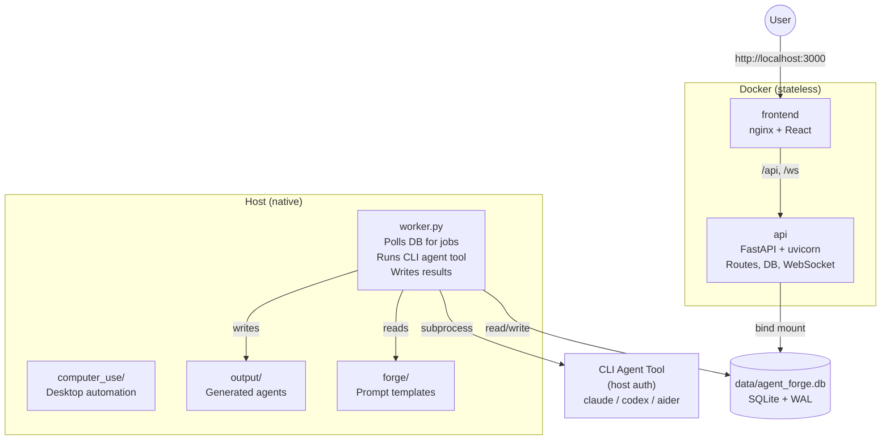
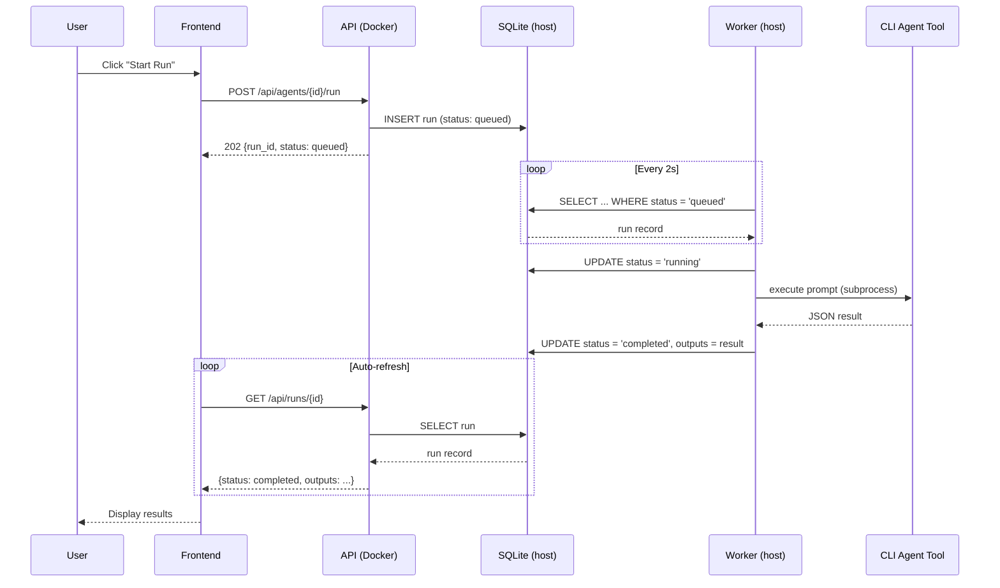

# Containerization Plan

Future Docker setup for Agent Forge. Not yet implemented -- this document captures the architecture decisions.

## Problem

CLI agent tools (Claude Code, Codex, Aider, etc.) authenticate on the host machine. For example, Claude Code uses `claude auth` which stores OAuth tokens in `~/.claude/` -- these tokens may need browser-based refresh that doesn't exist in containers. Other tools have similar host-specific auth. Running these tools inside Docker is fragile.

## Architecture: Split Worker



### Docker services (frontend + API server)

- **frontend**: Multi-stage build (Node build -> nginx). Serves the React app and reverse-proxies `/api` and `/ws` to the API container.
- **api**: Python 3.12 slim. Runs FastAPI with uvicorn. Handles HTTP routes, WebSocket, and DB operations. Does NOT run Claude Code -- just writes run records with status `queued`.

### Host processes

- **worker.py**: Simple polling loop. Watches the SQLite DB for runs with status `queued`, picks them up, executes via the locally-authenticated CLI agent tool (claude, codex, aider, etc.), writes results back. ~60 lines of Python.
- **computer_use/**: Desktop automation engine. Runs natively -- needs host display, mouse, keyboard access.

### Communication

The SQLite database (bind-mounted from host into the API container) is the only communication channel. No message queues, no RPC, no extra infrastructure.



SQLite WAL mode (already enabled) handles concurrent reads/writes from container + host.

### Bind mounts

```yaml
volumes:
  - ./data:/app/data              # SQLite DB
  - ./forge:/app/forge:ro         # Prompt templates (read-only in container)
  - ./output:/app/output          # Generated agent files
  - ./providers.yaml:/app/providers.yaml:ro
```

### Credentials

- **With API key**: Set `ANTHROPIC_API_KEY` in `.env`. Worker passes it to `claude` via environment. Works in Docker too if the API ever needs to call Claude directly.
- **With subscription**: User runs `claude auth` on host. Worker inherits the host's `~/.claude/` auth. No Docker credential issues.

### User experience

```bash
git clone https://github.com/santiagomd11/Agent-Forge.git
cd Agent-Forge
docker compose up -d          # frontend + API
python worker.py              # uses local claude auth
# Open http://localhost:3000
```

## Why not CLI agent tools in Docker?

CLI agent tools authenticate on the host:
- Claude Code stores OAuth tokens in `~/.claude/` that may need browser-based refresh
- Codex/Aider/others store API keys or configs in host-specific locations
- Mounting auth directories into containers is fragile and platform-dependent (`~` resolves differently on Windows, Mac, Linux)

The worker approach avoids this entirely -- tools run where they were installed and authenticated.

## Why not Anthropic's Xvfb approach for computer use?

Anthropic's computer-use-demo runs a virtual Linux desktop (Xvfb) inside Docker. This:
- Only controls Linux apps inside the container, not the host OS
- Cannot interact with the user's real browser, apps, or files
- Is a sandbox, not a real desktop automation tool

Agent Forge's computer_use engine controls the actual host -- real mouse, real keyboard, real screen across Windows, macOS, Linux, and WSL2. This cross-platform native access requires host execution, not containerization.

## Implementation checklist

- [ ] `api/Dockerfile` -- Python 3.12 slim, pip install requirements, copy api/ code
- [ ] `frontend/Dockerfile` -- Multi-stage: node build, nginx serve
- [ ] `frontend/nginx.conf` -- Reverse proxy /api and /ws to api container
- [ ] `docker-compose.yml` -- Two services, bind mounts, env vars
- [ ] `worker.py` -- Host-side execution worker (~60 lines)
- [ ] `.env.example` -- ANTHROPIC_API_KEY template
- [ ] `.dockerignore` -- Exclude node_modules, .venv, data/, .git
- [ ] Update README with `docker compose up` instructions
