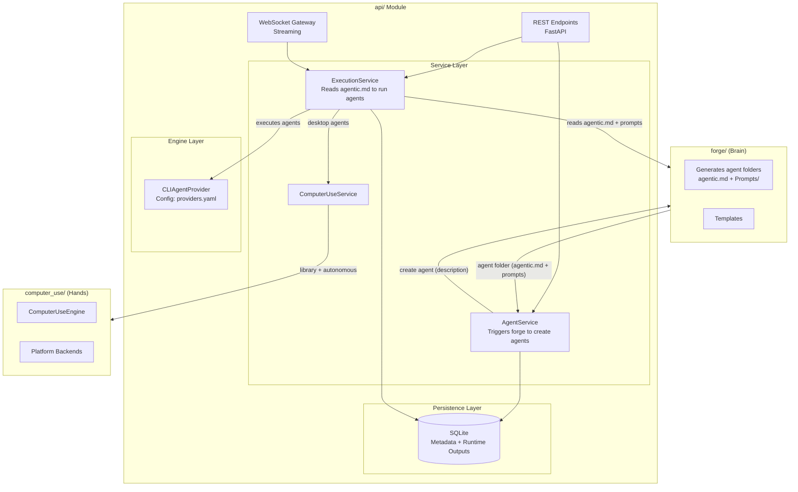
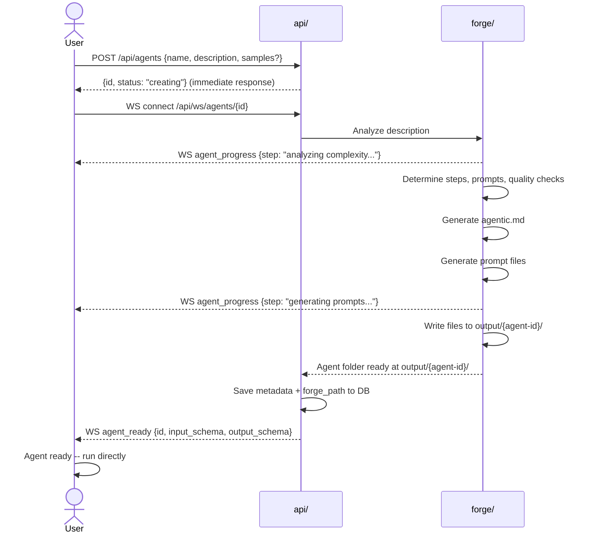
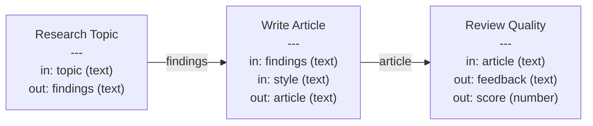
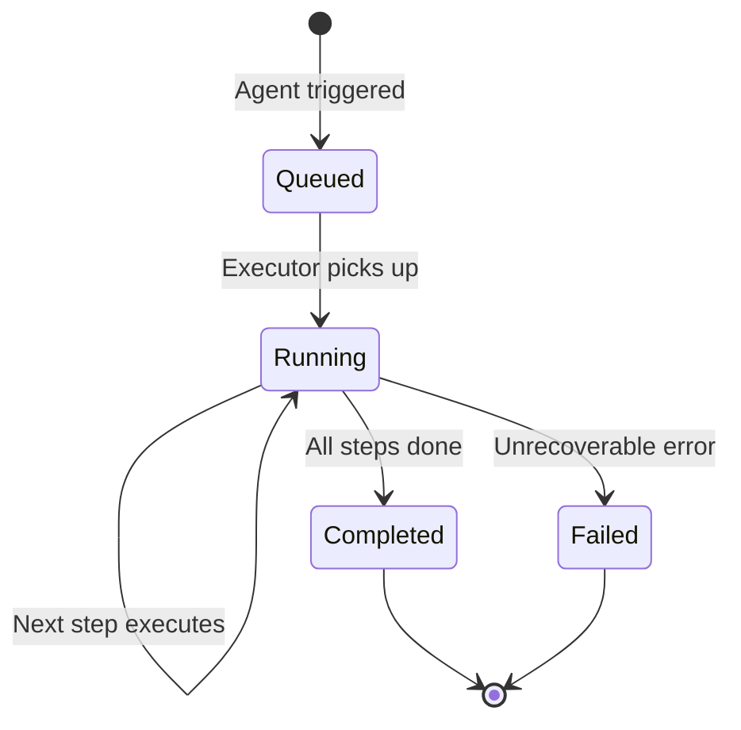
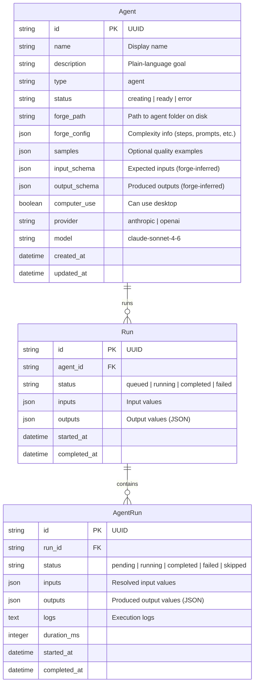
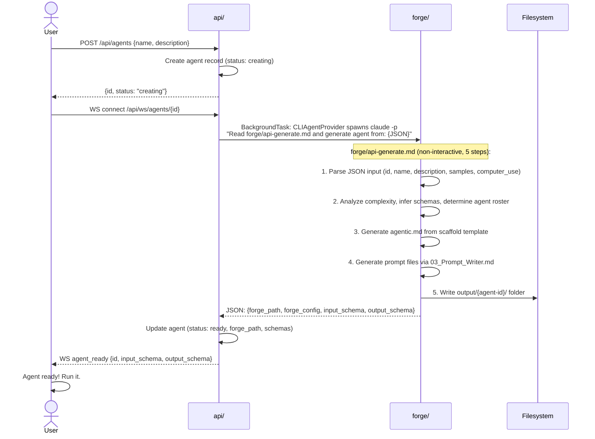
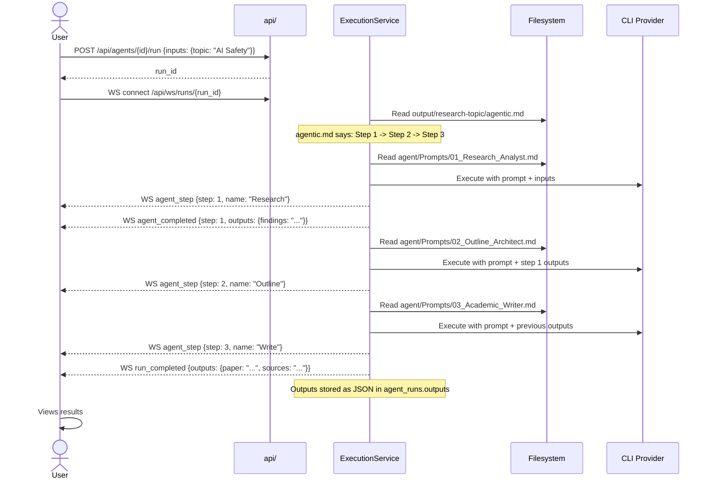
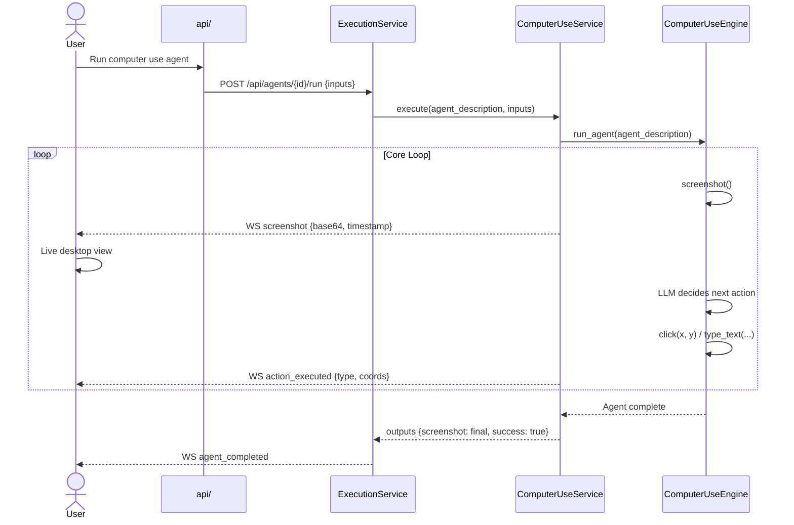

# API Module Architecture -- Agents

## Vision

Agent Forge becomes an **orchestration platform** for AI agents. Users describe a goal, forge builds a complete agent, and the user runs it. No code required.

The core unit is the **Agent** -- a **complete forge-generated workflow**: an orchestrator (`agentic.md`), prompts, quality checks, and config -- all in one folder. The user describes the goal, forge builds the entire agent. Internally, it can be as complex as forge decides.

Orchestration happens at the **agent level** (internal) -- Forge decides. Each agent has its own `agentic.md` that defines how it works internally: which prompts to run, in what order, with what quality checks. The user never sees this.

How agents get used is up to the user:

- **Standalone** -- User reads the agent's `agentic.md` and follows the steps manually or with Claude Code.
- **API platform** -- User triggers agent runs via the API. The execution service reads each agent's `agentic.md` and follows it programmatically.

The `api/` module joins `forge/` (the brain) and `computer_use/` (the hands) into a service that clients can consume.

### Design Principles

1. **Forge creates, users run** -- Forge's job is to build agents from descriptions (full workflow folders with `agentic.md` + prompts). The user decides when and how to run them.
2. **An agent is a workflow, not a prompt** -- A prompt is just a file. An agent is the whole thing: orchestrator, prompts, quality loops, config. Forge generates the complete agent.
3. **The user never thinks about prompts, models, or LLM internals** -- They describe what they want in plain language. Forge builds the agent.
4. **Module independence preserved** -- `forge/` and `computer_use/` remain standalone. The API imports them; they never import the API.
5. **Definition vs execution** -- An agent is a reusable template (like a Docker image). A run is one execution of it (like a container). You can run the same agent many times with different inputs.

---

## System Architecture



---

## Core Concepts

### Agent (Definition)

An agent is a **complete forge-generated workflow**. Not a prompt -- a prompt is just a file. An agent is the whole thing:

```
output/{agent-id}/
├── agentic.md              # How the agent works (orchestrator)
├── agent/Prompts/          # The prompts it uses internally
│   ├── 01_Research_Analyst.md
│   ├── 02_Outline_Architect.md
│   └── 03_Academic_Writer.md
└── ...
```

API-created agents use the agent's UUID as the folder name (`output/{agent-id}/`) to enable reliable cleanup on deletion. Standalone forge workflows (created via `forge/agentic.md`) continue to use kebab-case names (`output/{workflow-name}/`).

The user describes what the agent should accomplish in plain language. Forge runs its generation process and creates the full agent folder -- orchestrator, prompts, quality checks, everything.

- **Simple agent** -- Forge generates a lightweight `agentic.md` with one step and one prompt (e.g., "Summarize this text in 3 bullet points")
- **Complex agent** -- Forge generates a full `agentic.md` with multiple steps, multiple prompts, quality loops (e.g., "Research a topic thoroughly and write a paper with citations")

Either way, the internal complexity is hidden. When the execution service runs the agent, it reads the agent's `agentic.md` and follows it.

Optionally, the user can provide **quality samples** -- examples of what the final output should look like. Forge uses these to calibrate the generated prompts.

Agents can optionally enable computer use -- when enabled, the agent interacts with the desktop (screenshots, clicks, typing) via `computer_use/`.

### Agent Creation Flow

Creating an agent is not a simple CRUD operation. It's a **forge invocation** that generates files:



For simple descriptions, this takes seconds. For complex ones, it may take longer as forge generates multiple prompts with quality checks.

### Storage Model

Two types of data, two storage strategies:

| What | Where | Why |
|---|---|---|
| **Agent definition** (agentic.md + prompts) | Filesystem: `output/{agent-id}/` | Can be large, git-trackable, human-readable, editable, works standalone |
| **Agent metadata** (name, type, model, path) | DB: `agents` table | Queryable, drives the UI |
| **Runtime outputs** (what agents produce when run) | DB: `agent_runs.outputs` as JSON | Structured, displayed in UI |
| **Binary artifacts** (PDFs, images -- future) | Filesystem: `data/artifacts/{run_id}/` | Too large for DB, referenced via JSON in outputs |

The `agents` table stores a `forge_path` that points to the agent's folder on disk. At runtime, the execution service reads `agentic.md` from that folder and follows it to run the agent.

```
output/
  a1b2c3d4-e5f6.../                   # API agent (UUID as folder name)
    agentic.md                        # Internal orchestrator
    agent/Prompts/
      01_Research_Analyst.md
      02_Outline_Architect.md
      03_Academic_Writer.md

  my-workflow/                        # Standalone forge workflow (kebab-case name)
    agentic.md                        # One-step orchestrator
    agent/Prompts/
      01_Summarizer.md

data/
  agent_forge.db                      # Metadata, runs, runtime outputs
```

### Agent Input/Output Contract

Every agent declares what data it accepts and what it produces. Forge infers the input/output schema from the description and generates it. This is used when running agents -- the caller provides the required inputs and receives the declared outputs.



### Run (Execution)

A run is **one execution of an agent** with specific input values. The execution service reads the agent's `agentic.md` and follows it.



### Node Types

| Node Type | Behavior |
|---|---|
| **Agent** | Forge-generated workflow. Runs its internal `agentic.md`. Accepts inputs, produces outputs. |
| **Computer Use Agent** | Same as Agent, but includes desktop automation steps via `ComputerUseEngine` |

---

## Data Models



---

## Module Structure

```
api/
    __init__.py
    main.py                         # FastAPI app, lifespan, CORS
    config.py                       # Settings (env vars, defaults)

    models/
        __init__.py
        agent.py                    # Agent Pydantic models
        run.py                      # Run + agent run models
        common.py                   # Pagination, errors, enums

    routes/
        __init__.py
        agents.py                   # Agent creation (forge) + management
        runs.py                     # Run lifecycle + control
        computer_use.py             # Computer use status + direct control
        health.py                   # Health check
        ws.py                       # WebSocket route

    services/
        __init__.py
        agent_service.py            # Triggers forge, manages agent lifecycle
        execution_service.py        # Reads agentic.md, runs agents sequentially
        computer_use_service.py     # ComputerUseEngine wrapper

    engine/
        __init__.py
        executor.py                 # Reads agent's agentic.md, executes it
        providers.py                # Config-driven CLI provider (loads providers.yaml from project root)

    persistence/
        __init__.py
        database.py                 # SQLite connection, migrations
        repositories.py             # Data access layer

    websocket/
        __init__.py
        manager.py                  # Connection manager
        events.py                   # Event types

    docs/
        PHASE_A_AGENTS.md           # This document

    tests/
        __init__.py
        conftest.py
        test_agents.py
        test_runs.py
        test_executor.py
        test_database.py
        test_services.py
        test_websocket.py
        test_health.py

    Agent_Forge_API.postman_collection.json
    requirements.txt
```

---

## API Endpoints

### Agents (`/api/agents`)

| Method | Path | Description |
|---|---|---|
| `POST` | `/api/agents` | Create a new agent (triggers forge in background) |
| `GET` | `/api/agents` | List all agents |
| `GET` | `/api/agents/{id}` | Get agent by ID |
| `PUT` | `/api/agents/{id}` | Update agent metadata |
| `DELETE` | `/api/agents/{id}` | Delete agent (removes output folder via `forge_path` + DB record) |
| `POST` | `/api/agents/{id}/run` | Run an agent (must be status "ready") |
| `GET` | `/api/agents/{id}/runs` | List runs of this agent |

### Create Agent

The user describes what the agent should do. The API triggers forge to create the full agent.

```json
POST /api/agents

{
  "name": "Research Topic",
  "description": "Research a given topic using multiple sources. Produce a structured summary with key findings, supporting evidence, and a list of sources.",
  "steps": ["Research sources", "Synthesize findings", "Format report"],
  "samples": [
    "## Quantum Computing in Healthcare\n\n### Key Findings\n1. Drug discovery acceleration..."
  ],
  "computer_use": false,
  "provider": "anthropic",
  "model": "claude-sonnet-4-6"
}
```

Only `name` is required. All other fields are optional:
- `steps` -- explicit workflow steps; if omitted, forge infers them from the description (default: [])
- `samples` -- quality examples for forge to calibrate prompts
- `computer_use` -- whether the agent uses desktop automation (default: false)
- `provider` -- LLM provider key (default: "anthropic")
- `model` -- model identifier (default: "claude-sonnet-4-6")

The API returns immediately with the agent ID and status "creating". Forge generation runs as a background task:

```json
{
  "id": "uuid",
  "name": "Research Topic",
  "status": "creating"
}
```

Connect via WebSocket at `/api/ws/agents/{id}` for creation progress. When forge finishes, the agent transitions to "ready":

```json
{
  "id": "uuid",
  "name": "Research Topic",
  "status": "ready",
  "description": "Research a given topic using multiple sources...",
  "type": "agent",
  "forge_path": "output/{agent-id}/",
  "input_schema": [
    { "name": "topic", "type": "text", "required": true }
  ],
  "output_schema": [
    { "name": "findings", "type": "text" },
    { "name": "sources", "type": "text" }
  ],
  "computer_use": false,
  "forge_config": {
    "complexity": "multi_step",
    "steps": 3,
    "prompts": ["01_Research_Analyst.md", "02_Outline_Architect.md", "03_Academic_Writer.md"]
  },
  "provider": "anthropic",
  "model": "claude-sonnet-4-6"
}
```

For a simple description, forge generates a one-step agent:

```json
{
  "forge_config": {
    "complexity": "simple",
    "steps": 1,
    "prompts": ["01_Summarizer.md"]
  }
}
```

### Run Agent

Provide inputs and run. The execution service reads the agent's `agentic.md` and follows it.

```json
POST /api/agents/{id}/run

{
  "inputs": {
    "topic": "Quantum computing in drug discovery"
  }
}
```

Response:

```json
{
  "run_id": "uuid",
  "status": "queued"
}
```

Connect via WebSocket at `/api/ws/runs/{run_id}` for live progress.

### Runs (`/api/runs`)

| Method | Path | Description |
|---|---|---|
| `GET` | `/api/runs` | List runs (filterable by agent, status) |
| `GET` | `/api/runs/{id}` | Get run with step statuses |
| `POST` | `/api/runs/{id}/cancel` | Cancel a run |

### Computer Use (`/api/computer-use`)

| Method | Path | Description |
|---|---|---|
| `GET` | `/api/computer-use/status` | Platform info, availability |
| `POST` | `/api/computer-use/screenshot` | Capture current screen (planned) |

### Health (`/api/health`)

| Method | Path | Description |
|---|---|---|
| `GET` | `/api/health` | Server health + module availability |

```json
{
  "status": "healthy",
  "modules": {
    "forge": true,
    "computer_use": true
  },
  "platform": "wsl2",
  "version": "0.1.0"
}
```

### WebSocket

| Path | Description |
|---|---|
| `/api/ws/agents/{id}` | Agent creation progress (forge generating) |
| `/api/ws/runs/{id}` | Live execution progress for a run |

---

## WebSocket Protocol

All messages use a consistent envelope:

```json
{
  "type": "event_type",
  "data": {},
  "timestamp": "2026-03-06T10:30:00Z"
}
```

### Event Types

| Type | Direction | Description |
|---|---|---|
| `agent_creating` | Server -> Client | Forge is generating the agent |
| `agent_progress` | Server -> Client | Progress update during agent creation |
| `agent_ready` | Server -> Client | Agent creation complete |
| `agent_error` | Server -> Client | Agent creation failed |
| `run_started` | Server -> Client | Run began |
| `agent_started` | Server -> Client | An agent began executing |
| `agent_step` | Server -> Client | Internal step within an agent executing |
| `agent_completed` | Server -> Client | An agent finished (includes outputs) |
| `agent_failed` | Server -> Client | An agent failed |
| `screenshot` | Server -> Client | Screenshot from computer use agent (base64) |
| `action_executed` | Server -> Client | Computer use action performed (click, type, etc.) |
| `run_completed` | Server -> Client | All steps done |
| `run_failed` | Server -> Client | Run failed |

---

## Key Flows

### Flow 1: Create an Agent

User describes what they want. Forge creates the full agent (orchestrator + prompts + config).



### Flow 2: Run an Agent

The execution service reads the agent's `agentic.md` and follows it.



### Flow 3: Computer Use Agent

An agent that automates the desktop with live screenshot streaming.



---

## Engine

### `engine/executor.py`

```python
class AgentExecutor:
    """Executes a single agent by following its internal agentic.md."""

    async def execute(
        self,
        agent: Agent,
        inputs: dict,
        callback: EventCallback,
    ) -> dict:
        """Run an agent and return its outputs as JSON.

        1. Read agentic.md from agent.forge_path
        2. Parse the steps and prompt references
        3. For each internal step:
           a. Read the prompt file
           b. Call the LLM with prompt + inputs
           c. Pass outputs to the next internal step
        4. For computer use steps: delegate to ComputerUseService
        5. Return the final structured JSON outputs
        """
```

### Agent-Level Execution

```python
# Agent-level execution (via CLIAgentProvider)
async def execute(agent, inputs, callback):
    prompt = build_agent_prompt(agent, inputs)
    raw_output = await provider.execute(prompt=prompt, workspace=agent.forge_path)
    result = parse_output(raw_output, agent.output_schema)
    return result  # final outputs as JSON
```

The `CLIAgentProvider` spawns the configured CLI tool (Claude Code, Codex, Aider, etc.) as a subprocess, sends the prompt, and captures the output. Provider selection is config-driven via `providers.yaml`.

The provider strips the `CLAUDECODE` environment variable from subprocess calls to prevent nested-session detection errors when the API server is launched from within a Claude Code session.

### Forge Entry Point

Agent creation uses `forge/api-generate.md` -- a non-interactive 5-step orchestrator designed for programmatic invocation. Unlike the interactive `forge/agentic.md` (which asks the user questions), `api-generate.md` accepts a JSON payload and produces a complete agent folder without any user interaction. The `AgentService` invokes it via:

```
claude -p "Read forge/api-generate.md and generate an agent from: {JSON}" --dangerously-skip-permissions --output-format json
```

The JSON payload contains `id`, `name`, `description`, `samples`, and `computer_use`. When `id` is provided, forge uses `output/{id}/` as the output folder (enabling reliable cleanup on agent deletion). The output is a JSON object with `forge_path`, `forge_config`, `input_schema`, and `output_schema`.

---

## Persistence

### SQLite Schema

```sql
CREATE TABLE agents (
    id TEXT PRIMARY KEY,
    name TEXT NOT NULL,
    description TEXT NOT NULL DEFAULT '',
    type TEXT NOT NULL DEFAULT 'agent',
    status TEXT NOT NULL DEFAULT 'creating',
    forge_path TEXT DEFAULT '',
    forge_config TEXT DEFAULT '{}',
    samples TEXT DEFAULT '[]',
    input_schema TEXT DEFAULT '[]',
    output_schema TEXT DEFAULT '[]',
    computer_use INTEGER DEFAULT 0,
    provider TEXT NOT NULL DEFAULT 'anthropic',
    model TEXT NOT NULL DEFAULT 'claude-sonnet-4-6',
    created_at TEXT NOT NULL,
    updated_at TEXT NOT NULL
);

CREATE TABLE runs (
    id TEXT PRIMARY KEY,
    agent_id TEXT REFERENCES agents(id) ON DELETE SET NULL,
    status TEXT NOT NULL DEFAULT 'queued',
    inputs TEXT DEFAULT '{}',
    outputs TEXT DEFAULT '{}',
    started_at TEXT,
    completed_at TEXT
);

CREATE INDEX idx_runs_agent ON runs(agent_id);

CREATE TABLE agent_runs (
    id TEXT PRIMARY KEY,
    run_id TEXT NOT NULL REFERENCES runs(id) ON DELETE CASCADE,
    status TEXT NOT NULL DEFAULT 'pending',
    inputs TEXT DEFAULT '{}',
    outputs TEXT DEFAULT '{}',
    logs TEXT DEFAULT '',
    duration_ms INTEGER DEFAULT 0,
    started_at TEXT,
    completed_at TEXT
);

CREATE INDEX idx_agent_runs_run ON agent_runs(run_id);
```

---

## Configuration

Environment variables (prefix `AGENT_FORGE_`):

| Variable | Default | Description |
|---|---|---|
| `AGENT_FORGE_HOST` | `127.0.0.1` | Server host |
| `AGENT_FORGE_PORT` | `8000` | Server port |
| `AGENT_FORGE_DATABASE_PATH` | `data/agent_forge.db` | SQLite database path |
| `AGENT_FORGE_DEFAULT_PROVIDER` | `claude_code` | Provider key from `providers.yaml` |
| `AGENT_FORGE_PROVIDER_TIMEOUT` | `300` | Default timeout for provider execution |

Provider definitions live in `providers.yaml`. Adding a new CLI-based agentic tool means adding an entry -- zero code changes:

```yaml
# providers.yaml
providers:
  claude_code:
    name: "Claude Code"
    command: claude
    args: ["-p", "{{prompt}}", "--dangerously-skip-permissions", "--output-format", "json"]
    available_check: ["claude", "--version"]
    timeout: 300
```

Placeholders: `{{prompt}}` is replaced with the agent prompt, `{{workspace}}` with the working directory.

---

## Error Handling

```json
{
  "error": {
    "code": "AGENT_NOT_FOUND",
    "message": "Agent with id 'abc-123' not found",
    "details": {}
  }
}
```

| HTTP Status | Error Code | When |
|---|---|---|
| 400 | `INVALID_REQUEST` | Malformed request body |
| 404 | `AGENT_NOT_FOUND` | Agent ID does not exist |
| 404 | `RUN_NOT_FOUND` | Run ID does not exist |
| 409 | `AGENT_NOT_READY` | Trying to run an agent still being created |
| 409 | `RUN_NOT_ACTIVE` | Action on completed/cancelled run |
| 422 | `COMPUTER_USE_UNAVAILABLE` | Computer use requested but not available |
| 422 | `PROVIDER_NOT_CONFIGURED` | LLM provider not set up |
| 422 | `MISSING_INPUTS` | Run started without required inputs |
| 500 | `INTERNAL_ERROR` | Unexpected server error |
| 500 | `FORGE_ERROR` | Forge failed to generate the agent |

---

## Testing Strategy

```
api/tests/
    conftest.py              # TestClient, in-memory SQLite, mocked LLM, mocked forge
    test_agents.py           # Agent creation (mocked forge), management
    test_runs.py             # Run lifecycle (standalone agent runs)
    test_executor.py         # Agent execution (reads agentic.md, mocked LLM)
    test_database.py         # Database connection and schema
    test_services.py         # Service layer unit tests
    test_websocket.py        # WS events (creation progress + run progress)
    test_health.py           # Health endpoint
```

### Testing Principles

- All CLIAgentProvider calls mocked
- Forge invocations mocked (return pre-built agent folders)
- `ComputerUseEngine` mocked (no real desktop access)
- In-memory SQLite for integration tests
- Target: 80%+ coverage
