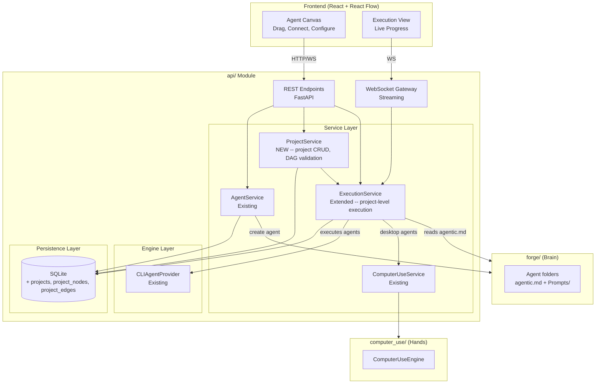
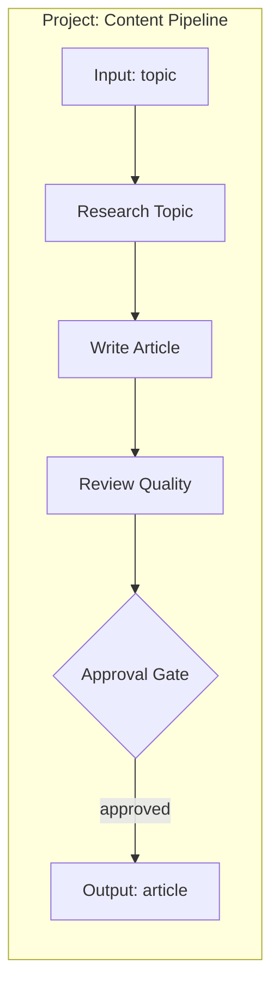
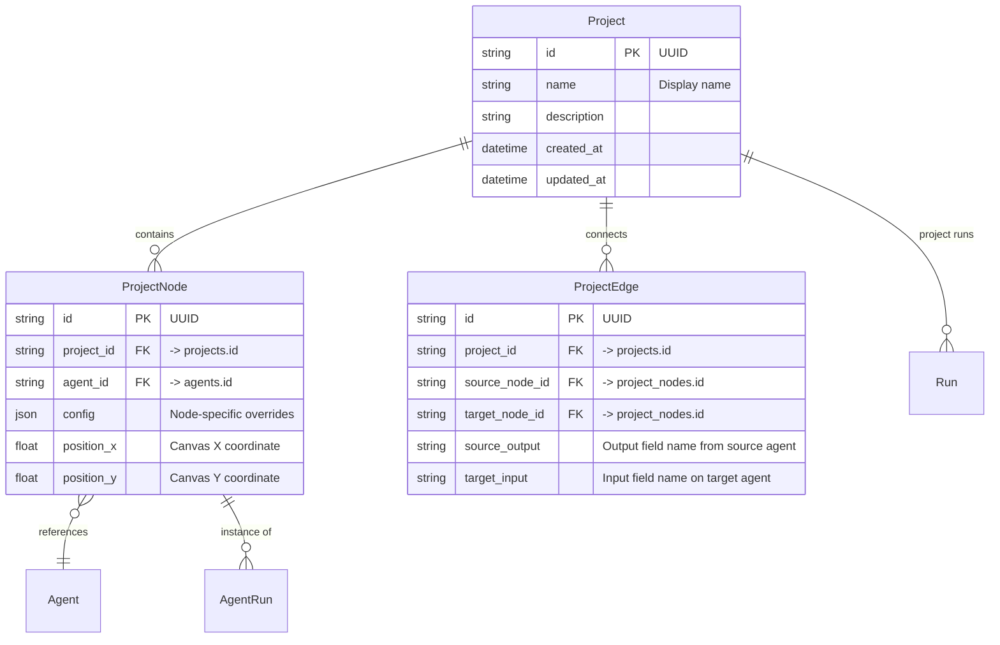
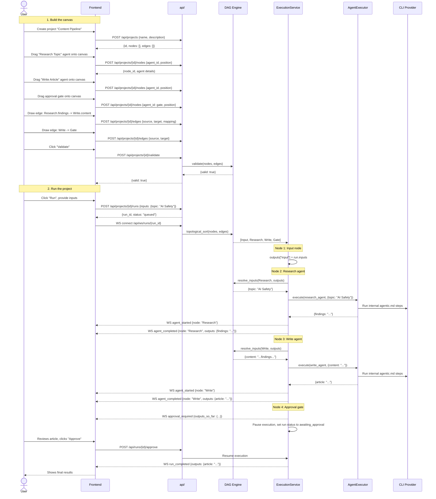

# Projects, Canvas, and DAG Orchestration

Architecture document for project-level orchestration -- the layer that connects agents into executable pipelines on a visual canvas.

---

## Prerequisites

This document assumes the following are complete and working:

- **Agents**: creation via forge, CRUD endpoints, `AgentService`, `Agent` model, `agents` table
- **Runs**: standalone agent runs via `POST /api/agents/{id}/run`, `Run` and `AgentRun` models, `runs` and `agent_runs` tables
- **WebSocket**: connection manager, event envelope, streaming for agent creation and run progress
- **Executor**: `AgentExecutor` reads an agent's `agentic.md` and runs its internal steps against an LLM
- **Persistence**: SQLite database with migrations, repository layer
- **Services**: `AgentService`, `ExecutionService`, `ComputerUseService`
- **Engine**: `CLIAgentProvider` (config-driven via `providers.yaml`), `AgentExecutor`

All of the above are referenced throughout this document but not re-explained.

---

## Vision

Agents are the atomic unit -- each one is a complete forge-generated workflow. This layer adds **project-level orchestration**: users connect agents into a DAG (directed acyclic graph) on a visual canvas, wire outputs to inputs, drop in approval gates, and hit run. The DAG engine handles execution order. Each agent still runs its own internal `agentic.md`; the project layer just defines what runs when and how data flows between them.

Two levels of orchestration, clearly separated:

1. **Agent level** (internal) -- Forge decides. Hidden from the user. Each agent has its own `agentic.md`.
2. **Project level** (canvas) -- User decides. Drag agents, draw edges, place gates.

---

## System Architecture



New components are marked **NEW**. Existing components from the agents layer are marked **Existing** -- they are used but not modified (except `ExecutionService` which is extended to support project-level DAG execution).

---

## What This Adds

- **Project** -- a named container for a DAG of connected agents
- **Canvas** -- the visual surface where users arrange and connect nodes
- **DAG validation** -- cycle detection, missing input checks, type mismatches
- **Node types** -- approval gates (pause execution), input nodes (project entry points), output nodes (final deliverables)
- **Project-level execution** -- run the full DAG in topological order, passing outputs between agents as JSON
- **Approval gates** -- pause mid-execution, show intermediate results, wait for user approve/revise
- **React + React Flow frontend** -- visual canvas editor with drag-and-drop, live execution view

---

## Core Concepts

### Project

A project is a **DAG of agents** with edges that define data flow. It is what the user builds visually on the canvas. The user decides which agents connect to which, where approval gates go, and what the entry/exit points are.

Each node on the canvas maps to one agent. Each agent runs according to its own internal `agentic.md`. The project DAG defines only the order and data flow between agents -- it never reaches inside an agent.



A project is a reusable template (like a Docker image). A project run is one execution of it (like a container). The same project can be run many times with different inputs.

### Canvas and DAG

The canvas is the frontend representation. The DAG is the backend data structure. They map one-to-one:

| Canvas | DAG |
|---|---|
| A box on the canvas | A `ProjectNode` with `position_x`, `position_y` |
| A line connecting two boxes | A `ProjectEdge` with `source_output` and `target_input` |
| The full arrangement | A validated `DAG` object with topological ordering |

The frontend sends node positions and edge connections to the API. The backend validates the graph structure and stores it. At run time, the DAG engine computes execution order.

### Node Types

| Node Type | Behavior |
|---|---|
| **Agent** | A forge-generated workflow. Already exists from the agents layer. On the canvas, the user places it as a node and wires its inputs/outputs. |
| **Approval Gate** | Pauses execution. Shows all outputs produced so far. Waits for the user to approve (continue) or revise (re-run the previous agent with feedback). Has no inputs/outputs of its own -- it acts as a checkpoint. |
| **Input** | Project-level entry point. Defines what data the user provides when starting a run. Maps to `run.inputs`. |
| **Output** | Project-level exit point. Captures the final deliverable. Maps to `run.outputs`. |

Approval gates, input nodes, and output nodes are stored in the `agents` table with their respective `type` field (`approval`, `input`, `output`). They use the same `Agent` model but have no `forge_path` or `agentic.md` -- their behavior is hardcoded in the execution engine.

### Project-Level Execution

When a project run starts:

1. The DAG engine computes topological order from the stored nodes and edges.
2. The executor walks the sorted nodes sequentially.
3. For each agent node, it resolves inputs by following edges backward to collect upstream outputs, then delegates to `AgentExecutor.execute()`.
4. For approval gates, it pauses and emits a WebSocket event. Execution resumes when the user responds.
5. For input nodes, it maps `run.inputs` into the outputs dictionary. For output nodes, it captures the final values.

All intermediate and final outputs are JSON, stored in `agent_runs.outputs`.

---

## Data Models

The existing `Agent`, `Run`, and `AgentRun` models remain unchanged in structure. Two new fields are added to existing tables, and three new models are introduced.

### New Models



### Fields Added to Existing Models

**Run** -- add `project_id`:

| Field | Type | Description |
|---|---|---|
| `project_id` | `TEXT, nullable, FK -> projects.id` | Set for project runs. Null for standalone agent runs. |

A run has either `agent_id` (standalone) or `project_id` (project run), never both.

**AgentRun** -- add `node_id`:

| Field | Type | Description |
|---|---|---|
| `node_id` | `TEXT, nullable, FK -> project_nodes.id` | Identifies which canvas node this execution corresponds to. Null for standalone runs. |

### Pydantic Models

```python
# models/project.py

class ProjectCreate(BaseModel):
    name: str
    description: str = ""

class ProjectUpdate(BaseModel):
    name: str | None = None
    description: str | None = None

class ProjectNodeCreate(BaseModel):
    agent_id: str
    config: dict = {}
    position_x: float = 0
    position_y: float = 0

class ProjectNodeUpdate(BaseModel):
    config: dict | None = None
    position_x: float | None = None
    position_y: float | None = None

class ProjectEdgeCreate(BaseModel):
    source_node_id: str
    target_node_id: str
    source_output: str
    target_input: str

class ProjectNodeResponse(BaseModel):
    id: str
    project_id: str
    agent_id: str
    agent: AgentResponse  # nested agent details
    config: dict
    position_x: float
    position_y: float

class ProjectEdgeResponse(BaseModel):
    id: str
    project_id: str
    source_node_id: str
    target_node_id: str
    source_output: str
    target_input: str

class ProjectResponse(BaseModel):
    id: str
    name: str
    description: str
    nodes: list[ProjectNodeResponse]
    edges: list[ProjectEdgeResponse]
    created_at: str
    updated_at: str

class ValidationError(BaseModel):
    type: str  # cycle_detected | missing_input | type_mismatch
    node_id: str | None = None
    message: str

class ValidateResponse(BaseModel):
    valid: bool
    errors: list[ValidationError]
```

---

## New Module Files

Only new or changed files are listed. Everything else from the existing structure remains as-is.

```
api/
    models/
        project.py                  # NEW: Project, ProjectNode, ProjectEdge Pydantic models

    routes/
        projects.py                 # NEW: Project CRUD, node/edge management, validate, project runs

    services/
        project_service.py          # NEW: Project lifecycle, DAG validation orchestration

    engine/
        dag.py                      # NEW: DAG validation, topological sort, input resolution

    tests/
        test_projects.py            # NEW: Project CRUD, node/edge management
        test_dag.py                 # NEW: Cycle detection, topological sort, input resolution
```

Changes to existing files:

| File | Change |
|---|---|
| `models/__init__.py` | Export new project models |
| `routes/__init__.py` | Register projects router |
| `main.py` | Include projects router |
| `persistence/database.py` | Add migration for new tables and ALTER statements |
| `persistence/repositories.py` | Add project/node/edge data access methods |
| `services/execution_service.py` | Add project-level execution logic (DAG walk) |
| `websocket/events.py` | Add `approval_required` and `approval_response` event types |

---

## API Endpoints

### Projects (`/api/projects`)

| Method | Path | Description |
|---|---|---|
| `POST` | `/api/projects` | Create a new project |
| `GET` | `/api/projects` | List all projects |
| `GET` | `/api/projects/{id}` | Get project with full graph (nodes + edges) |
| `PUT` | `/api/projects/{id}` | Update project metadata (name, description) |
| `DELETE` | `/api/projects/{id}` | Delete project and all its nodes/edges |

### Nodes (`/api/projects/{id}/nodes`)

| Method | Path | Description |
|---|---|---|
| `POST` | `/api/projects/{id}/nodes` | Add a node to the canvas |
| `PUT` | `/api/projects/{id}/nodes/{node_id}` | Update node position or config |
| `DELETE` | `/api/projects/{id}/nodes/{node_id}` | Remove node (cascades to connected edges) |

### Edges (`/api/projects/{id}/edges`)

| Method | Path | Description |
|---|---|---|
| `POST` | `/api/projects/{id}/edges` | Connect two nodes |
| `DELETE` | `/api/projects/{id}/edges/{edge_id}` | Disconnect two nodes |

### Validation

| Method | Path | Description |
|---|---|---|
| `POST` | `/api/projects/{id}/validate` | Validate the DAG (cycles, missing inputs) |

Request: no body required. Validates the current state of the project's graph.

Response:

```json
{
  "valid": true,
  "errors": []
}
```

Or on failure:

```json
{
  "valid": false,
  "errors": [
    {
      "type": "cycle_detected",
      "message": "Cycle found: node-A -> node-B -> node-A"
    },
    {
      "type": "missing_input",
      "node_id": "uuid-node-write",
      "message": "Required input 'style' has no incoming connection and no default"
    }
  ]
}
```

### Project Runs

| Method | Path | Description |
|---|---|---|
| `POST` | `/api/projects/{id}/runs` | Start a project run (executes the full DAG) |
| `POST` | `/api/runs/{id}/approve` | Approve at an approval gate (continues execution) |
| `POST` | `/api/runs/{id}/revise` | Request revision at a gate (re-runs previous agent with feedback) |

#### Start a Project Run

```json
POST /api/projects/{id}/runs

{
  "inputs": {
    "topic": "AI Safety"
  }
}
```

Response:

```json
{
  "run_id": "uuid",
  "status": "queued"
}
```

Connect via WebSocket at `/api/ws/runs/{run_id}` for live progress -- same channel used for standalone agent runs.

#### Approve

```json
POST /api/runs/{id}/approve

{}
```

No body required. Signals the executor to continue past the current approval gate.

#### Revise

```json
POST /api/runs/{id}/revise

{
  "feedback": "The article needs more citations in section 3."
}
```

The executor re-runs the agent immediately before the approval gate, injecting `feedback` into its inputs.

### Request/Response Examples

#### Create Project

```json
POST /api/projects

{
  "name": "Content Pipeline",
  "description": "Research a topic, write an article, review quality, approve, and publish."
}
```

```json
{
  "id": "uuid",
  "name": "Content Pipeline",
  "description": "Research a topic, write an article, review quality, approve, and publish.",
  "nodes": [],
  "edges": [],
  "created_at": "2026-03-07T10:00:00Z",
  "updated_at": "2026-03-07T10:00:00Z"
}
```

#### Add Node

```json
POST /api/projects/{id}/nodes

{
  "agent_id": "uuid-research-agent",
  "config": {},
  "position_x": 100,
  "position_y": 200
}
```

```json
{
  "id": "uuid-node",
  "project_id": "uuid-project",
  "agent_id": "uuid-research-agent",
  "agent": {
    "id": "uuid-research-agent",
    "name": "Research Topic",
    "type": "agent",
    "input_schema": [{"name": "topic", "type": "text", "required": true}],
    "output_schema": [{"name": "findings", "type": "text"}]
  },
  "config": {},
  "position_x": 100,
  "position_y": 200
}
```

#### Connect Nodes

```json
POST /api/projects/{id}/edges

{
  "source_node_id": "uuid-node-research",
  "target_node_id": "uuid-node-write",
  "source_output": "findings",
  "target_input": "content"
}
```

```json
{
  "id": "uuid-edge",
  "project_id": "uuid-project",
  "source_node_id": "uuid-node-research",
  "target_node_id": "uuid-node-write",
  "source_output": "findings",
  "target_input": "content"
}
```

---

## WebSocket Events

Two new event types, using the same envelope as all other WebSocket messages:

```json
{
  "type": "event_type",
  "data": {},
  "timestamp": "2026-03-07T10:30:00Z"
}
```

### `approval_required` (Server -> Client)

Sent when execution reaches an approval gate node.

```json
{
  "type": "approval_required",
  "data": {
    "run_id": "uuid",
    "node_id": "uuid-gate-node",
    "outputs_so_far": {
      "uuid-node-research": {"findings": "..."},
      "uuid-node-write": {"article": "..."}
    }
  },
  "timestamp": "2026-03-07T10:35:00Z"
}
```

The `outputs_so_far` dictionary is keyed by node ID. It contains all outputs produced by every agent that has completed up to this point. The frontend uses this to show intermediate results for user review.

### `approval_response` (Client -> Server)

Sent by the frontend when the user approves or requests revision.

Approve:

```json
{
  "type": "approval_response",
  "data": {
    "run_id": "uuid",
    "action": "approve"
  }
}
```

Revise:

```json
{
  "type": "approval_response",
  "data": {
    "run_id": "uuid",
    "action": "revise",
    "feedback": "The article needs more citations in section 3."
  }
}
```

The approval response can also be sent via REST (`POST /api/runs/{id}/approve` or `POST /api/runs/{id}/revise`). Both paths reach the same executor logic.

---

## Key Flow: Build and Run a Project

This is the end-to-end flow from canvas design through execution.



---

## DAG Engine

### `engine/dag.py`

The DAG engine is pure logic with no I/O -- it operates on lists of `ProjectNode` and `ProjectEdge` objects. This makes it straightforward to test.

```python
from dataclasses import dataclass
from typing import Any


@dataclass
class ValidationError:
    type: str       # cycle_detected | missing_input | type_mismatch
    node_id: str | None
    message: str


class DAG:
    """Validated directed acyclic graph of project nodes."""

    def __init__(self, nodes: list[ProjectNode], edges: list[ProjectEdge]):
        self.nodes = {n.id: n for n in nodes}
        self.edges = edges
        self._adjacency: dict[str, list[str]] = {}
        self._reverse: dict[str, list[ProjectEdge]] = {}
        self._build_adjacency()

    def _build_adjacency(self):
        """Build forward adjacency list and reverse edge index."""
        for node_id in self.nodes:
            self._adjacency[node_id] = []
            self._reverse[node_id] = []

        for edge in self.edges:
            self._adjacency[edge.source_node_id].append(edge.target_node_id)
            self._reverse[edge.target_node_id].append(edge)

    def validate(self) -> list[ValidationError]:
        """Check for cycles and missing required inputs.

        Returns an empty list if the DAG is valid.
        """
        errors = []
        errors.extend(self._detect_cycles())
        errors.extend(self._check_missing_inputs())
        return errors

    def _detect_cycles(self) -> list[ValidationError]:
        """Kahn's algorithm: if topological sort doesn't include all nodes, there's a cycle."""
        in_degree = {nid: 0 for nid in self.nodes}
        for edge in self.edges:
            in_degree[edge.target_node_id] += 1

        queue = [nid for nid, deg in in_degree.items() if deg == 0]
        visited = 0

        while queue:
            current = queue.pop(0)
            visited += 1
            for neighbor in self._adjacency[current]:
                in_degree[neighbor] -= 1
                if in_degree[neighbor] == 0:
                    queue.append(neighbor)

        if visited < len(self.nodes):
            # Find nodes involved in cycles for the error message
            cycle_nodes = [nid for nid, deg in in_degree.items() if deg > 0]
            return [ValidationError(
                type="cycle_detected",
                node_id=None,
                message=f"Cycle detected involving nodes: {', '.join(cycle_nodes)}"
            )]
        return []

    def _check_missing_inputs(self) -> list[ValidationError]:
        """Check that every required input on each agent node has an incoming edge."""
        errors = []
        for node_id, node in self.nodes.items():
            agent = node.agent
            if agent.type not in ("agent",):
                continue

            connected_inputs = {e.target_input for e in self._reverse[node_id]}
            for field in agent.input_schema:
                if field.get("required", False) and field["name"] not in connected_inputs:
                    errors.append(ValidationError(
                        type="missing_input",
                        node_id=node_id,
                        message=f"Required input '{field['name']}' on '{agent.name}' "
                                f"has no incoming connection and no default"
                    ))
        return errors

    def topological_sort(self) -> list[ProjectNode]:
        """Return nodes in execution order using Kahn's algorithm.

        Raises ValueError if the DAG has cycles (call validate() first).
        """
        in_degree = {nid: 0 for nid in self.nodes}
        for edge in self.edges:
            in_degree[edge.target_node_id] += 1

        queue = [nid for nid, deg in in_degree.items() if deg == 0]
        result = []

        while queue:
            current = queue.pop(0)
            result.append(self.nodes[current])
            for neighbor in self._adjacency[current]:
                in_degree[neighbor] -= 1
                if in_degree[neighbor] == 0:
                    queue.append(neighbor)

        if len(result) < len(self.nodes):
            raise ValueError("Cannot sort: DAG contains cycles")

        return result

    def resolve_inputs(self, node: ProjectNode, outputs: dict[str, dict]) -> dict:
        """Collect input values for a node by following edges backward.

        Args:
            node: The target node whose inputs to resolve.
            outputs: Map of node_id -> {field: value} for all completed nodes.

        Returns:
            Dict of input_name -> value, ready to pass to AgentExecutor.
        """
        resolved = {}
        for edge in self._reverse.get(node.id, []):
            source_outputs = outputs.get(edge.source_node_id, {})
            if edge.source_output in source_outputs:
                resolved[edge.target_input] = source_outputs[edge.source_output]
        return resolved
```

---

## Project-Level Execution

This logic lives in `services/execution_service.py`, extending the existing `ExecutionService` with a method for project runs.

```python
async def execute_project(
    self,
    project: Project,
    run: Run,
    callback: EventCallback,
):
    """Execute a project by walking its DAG in topological order.

    Each agent node delegates to AgentExecutor.execute().
    Approval gates pause and wait for user input.
    Input nodes seed the outputs dict from run.inputs.
    Output nodes capture final deliverables into run.outputs.
    """
    nodes = load_nodes(project.id)  # from DB, with agent details
    edges = load_edges(project.id)

    dag = DAG(nodes, edges)
    errors = dag.validate()
    if errors:
        raise InvalidDAGError(errors)

    sorted_nodes = dag.topological_sort()
    outputs: dict[str, dict] = {}  # node_id -> {field: value}

    for node in sorted_nodes:
        agent = node.agent

        # --- Input node ---
        if agent.type == "input":
            outputs[node.id] = run.inputs
            continue

        # --- Approval gate ---
        if agent.type == "approval":
            callback("approval_required", {
                "run_id": run.id,
                "node_id": node.id,
                "outputs_so_far": outputs,
            })
            update_run_status(run.id, "awaiting_approval")

            response = await wait_for_approval(run.id)

            if response.action == "revise":
                # Re-run the previous agent with feedback injected
                prev_node = find_previous_agent_node(node, sorted_nodes, edges)
                prev_inputs = dag.resolve_inputs(prev_node, outputs)
                prev_inputs["feedback"] = response.feedback
                result = await self.executor.execute(prev_node.agent, prev_inputs, callback)
                outputs[prev_node.id] = result
                # Re-evaluate from the gate (skip the gate itself on re-check)
                continue

            # action == "approve" -> continue to next node
            continue

        # --- Output node ---
        if agent.type == "output":
            resolved = dag.resolve_inputs(node, outputs)
            outputs[node.id] = resolved
            run.outputs = resolved
            continue

        # --- Agent node ---
        resolved = dag.resolve_inputs(node, outputs)

        # Create an AgentRun record for this node execution
        agent_run = create_agent_run(run.id, node.id)

        callback("agent_started", {"node_id": node.id, "agent": agent.name})
        update_run_status(run.id, "running")

        result = await self.executor.execute(agent, resolved, callback)

        outputs[node.id] = result
        update_agent_run(agent_run.id, status="completed", outputs=result)
        callback("agent_completed", {"node_id": node.id, "outputs": result})

    update_run_status(run.id, "completed")
    callback("run_completed", {"outputs": run.outputs})
```

The `wait_for_approval` coroutine blocks on an `asyncio.Event` that gets set when the user calls `POST /api/runs/{id}/approve` or `POST /api/runs/{id}/revise`. The approval response is stored in a shared dict keyed by `run_id`.

---

## SQL Schema

### New Tables

```sql
CREATE TABLE projects (
    id TEXT PRIMARY KEY,
    name TEXT NOT NULL,
    description TEXT DEFAULT '',
    created_at TEXT NOT NULL,
    updated_at TEXT NOT NULL
);

CREATE TABLE project_nodes (
    id TEXT PRIMARY KEY,
    project_id TEXT NOT NULL REFERENCES projects(id) ON DELETE CASCADE,
    agent_id TEXT NOT NULL REFERENCES agents(id) ON DELETE CASCADE,
    config TEXT DEFAULT '{}',
    position_x REAL DEFAULT 0,
    position_y REAL DEFAULT 0
);

CREATE INDEX idx_nodes_project ON project_nodes(project_id);

CREATE TABLE project_edges (
    id TEXT PRIMARY KEY,
    project_id TEXT NOT NULL REFERENCES projects(id) ON DELETE CASCADE,
    source_node_id TEXT NOT NULL REFERENCES project_nodes(id) ON DELETE CASCADE,
    target_node_id TEXT NOT NULL REFERENCES project_nodes(id) ON DELETE CASCADE,
    source_output TEXT NOT NULL,
    target_input TEXT NOT NULL
);

CREATE INDEX idx_edges_project ON project_edges(project_id);
```

### ALTER Statements for Existing Tables

The `runs` table already has `project_id` as a nullable column from the initial schema. The `agent_runs` table already has `node_id` as a nullable column. The following indexes should be added if not already present:

```sql
-- Index for efficient project run lookups
CREATE INDEX IF NOT EXISTS idx_runs_project ON runs(project_id);

-- Index for efficient node-level run lookups
CREATE INDEX IF NOT EXISTS idx_agent_runs_node ON agent_runs(node_id);
```

If the columns do not exist (e.g., the database was created before these were planned), use:

```sql
ALTER TABLE runs ADD COLUMN project_id TEXT REFERENCES projects(id);
ALTER TABLE agent_runs ADD COLUMN node_id TEXT REFERENCES project_nodes(id);
```

---

## Error Codes

New error codes introduced by this layer. Existing error codes (`AGENT_NOT_FOUND`, `RUN_NOT_FOUND`, etc.) still apply.

| HTTP Status | Error Code | When |
|---|---|---|
| 400 | `INVALID_DAG` | Project has cycles, missing required inputs, or type mismatches |
| 404 | `PROJECT_NOT_FOUND` | Project ID does not exist |
| 409 | `NO_GATE_PENDING` | Calling approve/revise when no approval gate is waiting |

Error response format (same envelope as all API errors):

```json
{
  "error": {
    "code": "INVALID_DAG",
    "message": "Project DAG validation failed",
    "details": {
      "errors": [
        {
          "type": "cycle_detected",
          "message": "Cycle detected involving nodes: node-A, node-B"
        }
      ]
    }
  }
}
```

---

## Tests

### `test_projects.py`

Tests project CRUD and canvas operations against the API.

```python
# Project lifecycle
def test_create_project()
def test_list_projects()
def test_get_project_with_nodes_and_edges()
def test_update_project_metadata()
def test_delete_project_cascades_nodes_and_edges()

# Node management
def test_add_node_to_project()
def test_add_node_with_nonexistent_agent_returns_404()
def test_update_node_position()
def test_update_node_config()
def test_delete_node_cascades_edges()

# Edge management
def test_create_edge_between_nodes()
def test_create_edge_with_nonexistent_node_returns_404()
def test_delete_edge()
def test_create_duplicate_edge_returns_409()

# Validation
def test_validate_valid_dag()
def test_validate_dag_with_cycle()
def test_validate_dag_with_missing_input()

# Project runs
def test_start_project_run()
def test_start_run_on_invalid_dag_returns_400()
def test_approve_at_gate()
def test_revise_at_gate()
def test_approve_with_no_gate_pending_returns_409()

# Edge cases
def test_get_nonexistent_project_returns_404()
def test_add_node_to_nonexistent_project_returns_404()
```

### `test_dag.py`

Tests the DAG engine as pure logic -- no HTTP, no database.

```python
# Validation
def test_valid_linear_dag()
def test_valid_dag_with_branches()
def test_cycle_detected_two_nodes()
def test_cycle_detected_three_nodes()
def test_self_loop_detected()
def test_missing_required_input()
def test_all_required_inputs_connected()
def test_optional_input_not_required()
def test_multiple_validation_errors()

# Topological sort
def test_topological_sort_linear()
def test_topological_sort_diamond()
def test_topological_sort_wide()
def test_topological_sort_raises_on_cycle()

# Input resolution
def test_resolve_inputs_single_edge()
def test_resolve_inputs_multiple_edges()
def test_resolve_inputs_missing_upstream_output()
def test_resolve_inputs_no_edges()

# Node types
def test_input_node_provides_run_inputs()
def test_output_node_captures_final_values()
def test_approval_gate_has_no_schema()
```

### Test Infrastructure

Tests use the same `conftest.py` fixtures as the existing test suite. Key additions:

```python
# conftest.py additions

@pytest.fixture
def sample_project(client, sample_agents):
    """Create a project with three agent nodes and two edges."""
    resp = client.post("/api/projects", json={"name": "Test Pipeline"})
    project_id = resp.json()["id"]

    nodes = []
    for agent in sample_agents:
        resp = client.post(f"/api/projects/{project_id}/nodes", json={
            "agent_id": agent["id"],
            "position_x": len(nodes) * 200,
            "position_y": 100,
        })
        nodes.append(resp.json())

    # Wire first -> second
    client.post(f"/api/projects/{project_id}/edges", json={
        "source_node_id": nodes[0]["id"],
        "target_node_id": nodes[1]["id"],
        "source_output": "output",
        "target_input": "input",
    })

    return project_id, nodes
```

---

## Frontend

### Technology

| Library | Purpose |
|---|---|
| React 19 | UI framework |
| TypeScript | Type safety |
| Vite 7 | Build tool and dev server |
| React Flow (`@xyflow/react`) | Canvas with draggable nodes and connectable edges |
| TanStack Query | Server state management (API calls, caching) |
| React Router | Client-side routing |
| Lucide React | Icons |

### Pages

| Route | Component | Description |
|---|---|---|
| `/projects` | `Projects` | List all projects |
| `/projects/new` | `ProjectEditor` | Create a new project |
| `/projects/:id` | `ProjectEditor` | Edit project metadata |
| `/projects/:id/canvas` | `ProjectCanvas` | Visual DAG editor with React Flow |
| `/runs` | `Runs` | List all runs (standalone + project) |
| `/runs/:id` | `RunViewer` | Live execution view for a run |

### Canvas Architecture

The `ProjectCanvas` component is the core of the frontend. It renders a React Flow instance with:

- **Custom node component** (`TaskNode`) -- renders each node as a styled card with typed handles (input on the left, output on the right). The node appearance varies by agent type:
  - Agent nodes: blue, with a document icon
  - Approval gates: yellow, with a checkmark icon
  - Input/output nodes can use distinct styling as needed

- **Node operations** -- drag to reposition (updates `position_x`, `position_y` via `PUT`), select to view details in a side panel, delete via keyboard or context menu

- **Edge operations** -- drag from a source handle to a target handle to create a connection (calls `POST /api/projects/{id}/edges`), click an edge to select/delete it

- **Side panel** -- when a node is selected, shows the agent's name, description, input/output schema, and a dropdown to swap the agent. When adding a new node, shows the agent picker.

- **Toolbar** -- "Add Node" button (opens agent picker), "Validate" button (calls the validate endpoint and highlights errors), "Run" button (prompts for inputs, starts a project run)

### State Management

The canvas maintains two layers of state:

1. **Server state** (TanStack Query) -- the canonical project graph. Fetched via `GET /api/projects/{id}`, includes nodes and edges. Mutations (`POST`, `PUT`, `DELETE`) invalidate the query cache.

2. **Local state** (React `useState`) -- transient node position changes during drag. Committed to the server on drag end. This avoids sending a `PUT` on every pixel of mouse movement.

```
Server state (TanStack Query)
    |
    v
Merge with local overrides
    |
    v
React Flow nodes/edges
    |
    v
Render canvas
```

### WebSocket Integration

The `RunViewer` page connects to `/api/ws/runs/{run_id}` and handles all event types. For project runs, the key addition is:

- On `approval_required`: display a modal with `outputs_so_far`, showing intermediate results from each completed agent. Provide "Approve" and "Revise" buttons.
- On "Approve" click: send `POST /api/runs/{id}/approve`.
- On "Revise" click: show a text input for feedback, then send `POST /api/runs/{id}/revise` with the feedback.

### API Client

The frontend API client (`api/projects.ts`) wraps all project endpoints:

```typescript
export const projectsApi = {
  list: () => get<Project[]>('/api/projects'),
  get: (id: string) => get<Project>(`/api/projects/${id}`),
  create: (data: ProjectCreate) => post<Project>('/api/projects', data),
  update: (id: string, data: ProjectUpdate) => put<Project>(`/api/projects/${id}`, data),
  delete: (id: string) => del(`/api/projects/${id}`),

  addNode: (projectId: string, data: NodeCreate) =>
    post<ProjectNode>(`/api/projects/${projectId}/nodes`, data),
  updateNode: (projectId: string, nodeId: string, data: NodeUpdate) =>
    put<ProjectNode>(`/api/projects/${projectId}/nodes/${nodeId}`, data),
  deleteNode: (projectId: string, nodeId: string) =>
    del(`/api/projects/${projectId}/nodes/${nodeId}`),

  addEdge: (projectId: string, data: EdgeCreate) =>
    post<ProjectEdge>(`/api/projects/${projectId}/edges`, data),
  deleteEdge: (projectId: string, edgeId: string) =>
    del(`/api/projects/${projectId}/edges/${edgeId}`),

  validate: (projectId: string) =>
    post<ValidateResponse>(`/api/projects/${projectId}/validate`),

  startRun: (projectId: string, inputs: Record<string, unknown>) =>
    post<{ run_id: string }>(`/api/projects/${projectId}/runs`, { inputs }),
};
```
